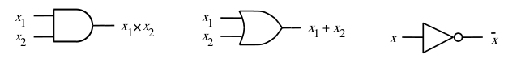
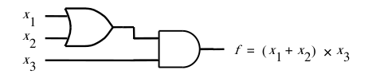

# Digital Hardware and Logic Gates

## Digital Hardware Concepts

### Digital Hardware

- Hardware (HW) means electronic circuits
- Digital means every wire (or signal) can be in one of two (binary) states
	- Electrically, the states are two different voltage levels (e.g. 5V and 0V)
	- We abstractly define two logic values (1 and 0) to be associated with these two voltage levels
	- We also use the terms "true" and "false"
- Abstraction is key to much of this course!

### Representing Information

- Every signal means something (abstractly)
- A single signal can represent some state, or be used as a means of control
- Multiple signals can be grouped together to create a binary value
	- Each signal is a bit (binary digit)
- The same multi-bit value can mean different things in different contexts...

### Putting values in context

- The 6-bit value 101000 might mean
	- 40, as an unsigned number, or address
	- -24, if viewed as a 6-bit signed number
	- "store byte", as an opcode (instruction)
- Sometimes, leading 0's are implied
	- 101000 as an 8-bit unsigned number is still 40
		- But it's not still -24 as an 8-bit signed number (it's also 40)
- With no context, the default is to interpret as an unsigned (i.e. no negatives) number

---

## Counting in Binary

- Insight into unsigned numbers
- When we count, we start from 0, add 1 at each step:
	- 0+1 = 1
	- 1+1 = 2, but we can't express 2
- In decimal, 9+1 = 10
	- Carry into next position and go back to 0
	- Same with binary, but that happens at 1+1
- 1+1 = 10, 10+1 = 11, 11+1 = 100, etc.
- What is 111?

### Counting from 0 to 15

- You will need to know this range of binary numbers
- Leading 0's: 3 as a 4-bit number is 0011

|Decimal|Binary|
|--|----|
|0 |0   |
|1 |1   |
|2 |10  |
|3 |11  |
|4 |100 |
|5 |101 |
|6 |110 |
|7 |111 |
|8 |1000|
|9 |1001|
|9 |1001|
|10|1010|
|11|1011|
|12|1100|
|13|1101|
|14|1110|
|15|1111|

---

## ASCII codes

- Another context for representing letters
	- A table can be found [here](https://www.asciitable.com/)
- ASCII codes are 7-bit values (between 0 and 127)

---

## Logic building blocks

### Logic Circuit Building Blocks

- Logic circuits are functions that generate an output based on a set of inputs
	- Inputs and output are binary/logical values
- Three fundamental operations
	- AND (output is true only if all inputs are true)
	- OR (output is true if any of the inputs are true)
	- NOT (output is the inverse of the input)
		- Also called INV (for inverter)
- **All** logic functions are made by a combination of these three operations

### Logic in algebraic form

- Note: variable names are generic; they have no inherent meaning
- AND
	- Expressed as a product (multiplication)
	- `Y = X1 * X2` (or just `X1X2`)
- OR
	- Expressed as a sum (addition)
	- `Y = X1 + X2`
- NOT
	- `Y = !X1`

### Logic Gates

- Because these are HW circuits, it's useful to have a schematic abstraction
	- We call these logic "gates"
	- The symbols for AND, OR, and INV are below
	- AND and OR can have more than 2 inputs
		- Same symbol
- Note the overbar used at the output of the inverter
	- Just another way of expressing `!` (or `~`)

### Logic Circuits

- If we want a function that is different than just AND or OR, or we have more than two signals to work with, we can combine gates into a larger circuit
- Much of what we'll be covering is how to define the circuit needed to implement a given logic function

---

[Truth tables, minterms, and simple synthesis ->](2.md)
