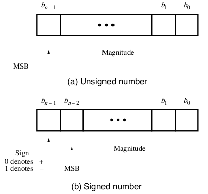
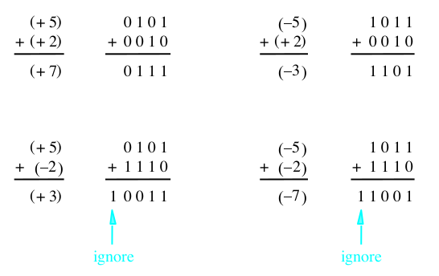
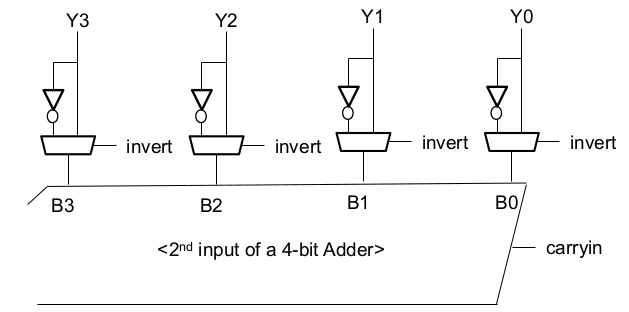
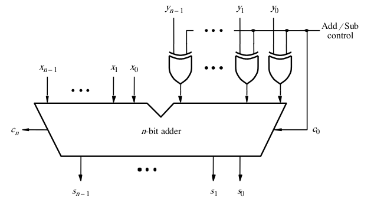

[\<- Number systems and adders](9.md)

---

# Signed numbers and subtraction

## Signed numbering systems

### Negative numbers, how?

- All our numbers so far have been positive
	- N bits a range of 0 to (2^N)-1
	- Referred to as unsigned numbers
- Signed numbers are numbers that can be either positive or negative
	- But we still only have 1s and 0s to work with
	- Requires a scheme/convention/agreement on how to interpret a given set of 1s and 0s
	- That convention applies to both positive and negative numbers

### Signed Numbers

- Dedicate the Most Significant Bit (MSB) to be a "sign" bit, with 1 meaning negative

### Considerations

- Must be clear about how many bits are being used
	- Different sizes can be used in different contexts: 4-bit, 8-bit, 16-bit, 32-bit
		- With 4-bit numbers, bit 3 is the sign bit
	- Leading 0's not always expressed
- Ideally we'd like to use the same adder circuit and it just works, whether the numbers are positive or negative
	- N + (-N) should give us 0

### Schemes we will NOT use

- Sign-and-Magnitude
	- Easy to understand but not useful in reality
	- 0101 -> 5
	- 1101 -> -5
	- What would we get if we added these two?
- 1's complement
	- Flip all the bits for negative numbers
	- 0101 -> 5
	- 1010 -> -5
	- Adding yields all 1s

---

## 2's complement numbers and the process of negation

### 2's Complement, our standard

- To "negate", flip all the bits and add 1
	- Find -5 from 5
		- X = 0101 (5)
		- ~X = 1010
		- -X = 1011 (-5)
	- Find -2 from 2
		- X = 0010 (2)
		- ~X = 1101
		- -X = 1110 (-2)
- Works both ways
	- Find what 1101 is
		- X = 1101 (?)
		- ~X = 0010
		- -X = 0011 (3)
		- **X = -3**
	- Find what 1001 is
		- X = 1001 (?)
		- ~X = 0110
		- -X = 0111 (7)
		- **X = -7**

---

## Adding 2's complement numbers

### Examples of addition

- Final carry-out can be ignored (for now)
	- 4-bit addition => a 4-bit result

### A comparison

- Schemes cover both positive and negative

|b3b2b1b0|Sign and magnitude|1's complement|2's complement|
|--------|------------------|--------------|--------------|
|0111    |+7                |+7            |+7            |
|0110    |+6                |+6            |+6            |
|0101    |+5                |+5            |+5            |
|0100    |+4                |+4            |+4            |
|0011    |+3                |+3            |+3            |
|0010    |+2                |+2            |+2            |
|0001    |+1                |+1            |+1            |
|0000    |+0                |+0            |+0            |
|1000    |-0                |-7            |-8            |
|1001    |-1                |-6            |-7            |
|1010    |-2                |-5            |-6            |
|1011    |-3                |-4            |-5            |
|1100    |-4                |-3            |-4            |
|1101    |-5                |-2            |-3            |
|1110    |-6                |-1            |-2            |
|1111    |-7                |-0            |-1            |

### Converting number "size"

- Size is typically a constraint of the circuit
	- A 4-bit adder can only take 4-bit inputs and generate a 4-bit result
- Sometimes there might be a mismatch
	- You're given a 4-bit number but need to use it in an 8-bit adder
	- Sign extension => fill in with the sign bit
- 0xF as a 4-bit number is -1
- 0xF as an 8-bit number is 16 (leading 0's)
	- 0xFF is -1 as an 8-bit number

---

## 2's complement subtraction

- We know X-Y is the same as X+(-Y)
- In 2's complement, -Y is (~Y+1)
	- `~` means we invert all the bits
- So if we have X and Y in 2's complement form, and we want to subtract
	- Use an adder
	- Invert all the bits in Y
	- Add 1
- This allows us to reuse the adder
	- don't need to separate circuit for subtraction

---

## Enhancing an adder circuit to do subtraction

### How to reuse adder

- Want to use same circuit for both addition and subtraction
	- Need a control signal to determine which
- Adder takes two operand inputs, A and B
	- If calculating X-Y, need to pass -Y to input B
	- Otherwise pass Y directly thru to B
- Two choices for B: Y if adding, -Y if subtracting
	- We use muxes when there are choices

### Selective inversion of 2nd op

- Control signal "invert" will cause the B port of the adder to get ~Y
- To subtract, assert "invert" and "carryin"

### Special characteristic of XOR

- We've talked about viewing one of the inputs to AND/OR gates as a control signal
	- AND: 1 enables, 0 disables
	- OR: 1 disables, 0 enables
- Applying the same concept to XOR:
	- 0 causes the other input to pass thru
	- 1 causes the other input to invert
	- i.e. passes true to complement version of input based on control signal
		- Just like we need to reuse our adder for subtraction

### Using XOR for selective inv.

- The XOR gates allow for selective inversion
	- If subtracting, invert (and add 1)
	- If adding, don't

---

## Subtraction is negation and then addition

### About subtraction

- When calculating on paper, it is possible to directly calculate the subtraction operation
- WE WILL NOT DO THIS IN THIS CLASS
- We are learning things in the context of underlying circuit implementations
- We have learned how to build an adder, not a subtractor
- When you need to show subtraction, you \*must\* negate and add

---

[Overflow, Comparison, ALU ->](11.md)
