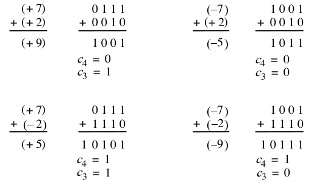
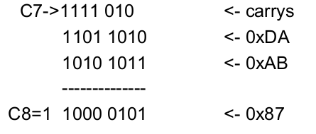
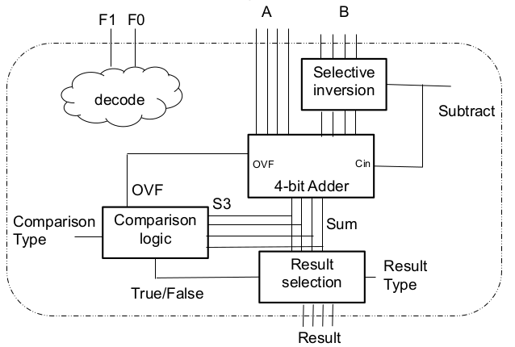
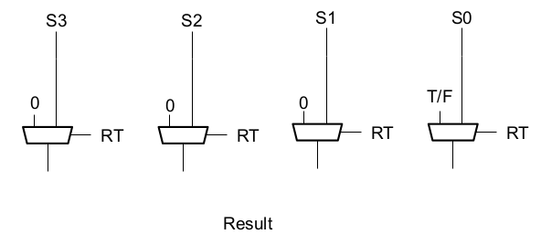

[\<- Signed numbers and subtraction](10.md)

# Overflow, Comparison, ALU

## Overflow

- Remember, signed numbers, and hardware computation units, have a fixed number of bits
- What happens if the result of the addition/subtraction needs more than the available bits?
- Need to detect this condition. What happens next depends on the "system" in which the circuit is implemented

### Determining Overflow

- Adding two numbers with the same "sign" should not yield a result with the opposite sign

### HW detection of overflow

- As humans, we can look at the sum of two numbers and see whether there's overflow
- A HW circuit, like a 4-bit adder, needs a way to "flag" whether the result is valid
	- The carry-in to the sign bit position (C3) should match the carry-out (C4)
- Overflow = C3 ^ C4 (for a 4-bit adder)
	- C7 ^ C8 for an 8-bit adder
	- Remember: `^` is XOR
- Note: adding a negative and positive number can never overflow

### 8-bit signed addition example

- Computation of 0xDA + 0xAB
	- Two negative 8-bit numbers
	

- No overflow: C7 == C8
	- Even though C3 != C4
- It's the sign bit that we care about!

---

## Comparison

### Comparators

- Often it's usefule to detect comparisons
	- `==`, `>`, `<`, `!=`, `>=`, `<=`
	- "Answer" is true/false, yes/no, 1/0
- XOR gates provide an easy means to determine if two bits are equal (`==`)
	- Apply to each bit position and OR the results
	- A 1 means the bits don't match => inequality
- For unsigned `>` or `<`, start at the MSB (most significatn bit) and find the first mismatch
	- Really only practical for small # of bits

### Signed Comparison

- Subtract the numbers (A-B) and check the result
	- Three mutually exclusive possibilities
		- A-B > 0 => A>B
		- A-B = 0 => A=B
		- A-B < 0 => A<B
- We already have a sign bit for the result
	- Can be used to determine A-B<0, but doesn't differentiate the other two possibilities
	- Need to add a zero-detect

---

## Interpreting overflow when doing comparison

- Since we don't need the actual result of the subtraction, we can use overflow
	- It doesn't matter that the computed result is wrong
- Negative overflow
	- Adding two negatives, sign bit of result is 0
	- Should be 1, can be interpreted as a negative
- Positive overflow
	- Adding two positives, sign bit of result is 1
	- Should be 0, can be interpreted as positive

---

## ALU concept and example

### Arithmetic Logic Unit (ALU)

- Abstraction layered on top of an adder
	- Used for any number of operations that generate a result based on two inputs
- Operands (A and B) and a "command"
	- We've already seen this for subtraction
- Output is either a computation or a comparison result
	- For comparison type command, output is 1 for true, 0 for false (it's a yes/no question)

### Example ALU

- Limit ourselves to add, subtract, and comparison
- An example 2-bit command (F1, F0)
	- 00 means add
	- 01 means subtract
	- 11 means "set on less than"
		- i.e. "true or false: A is less than B"
- Note that we're not using the encoding 10 just yet
	- You'll be filling this in as a homework problem

### Example ALU block diagram

- F1, F0 decoded to generate controls

---

## Comparison logic

- Assumes that the decode of F1 and F0 will cause Subtract to be asserted
- Define a signal called LT (for Less Than) to tell us "yes, A is less than B"
- Using Sum and OVF, when would LT be true? How do we know A-B<0?

|S3 OVF|LT|
|------|--|
|00    |0 |
|01    |1 |
|10    |1 |
|11    |0 |

- For this first example, where the only comparison is "less than":
	- The "Subtract" signal is just F0
	- The "Comparison Type" input isn't needed
	- The "True/False" output is just LT
- Adding another comparison command would require use of the "Comparison Type" signal to select what value to put on the "True/False" output

---

## Result Selection

### Selecting final result

- If command is specifying add or subtract, result should be output of adder
- If command is specifying a comparison, result should be either 0001 (true) or 0000 (false)
	- Bits 3,2,1 are 000 in either case, bit 0 is output of comparison logic
- How to choose between these results?
	- What circuit do we use for a choice?

### Result selection circuit

- RT = Result Type
- T/F = True/False

---

[Latches ->](12.md)
