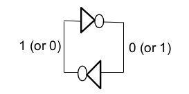

[\<- Overflow, comparison, and the design of an ALU](11.md)

---

# Latches

## A circuit that remembers

### Sequential Circuits

- Circuits that have "memory"
	- A subset of the inputs control whether the output is "allowed" to change
	- Otherwise the output will hold its "state"
- In the circuit below, we want On to assert when Set asserts, and to stay asserted even if Set goes back to 0; Reset will clear

### Inverters in a feeback loop

- Wires will hold onto value forever => memory

- But how to get a value onto one of the wires?

### Controlling the feedback loop

- The control signal affects the output
	- If control = 0, NOR gate acts like an inverter
	- If control = 1, output is 0

---

## The SR latch

- Qa is primary output (Qb is the inverse)
	- (S)et Qa to 1, or (R)eset to 0

---

## Synchronizing with a clock signal

### Using sequential circuits

- A latch can hold one bit of info (state)
- Typically we want to hold onto multiple bits of info
	- A counter is a typical example
- A 2-bit counter cycles thru 00, 01, 10, 11, then back to 00, 01, etc.
- Generally we want the two bits to change at the same time
	- How to do this?

### Using a Clock for Control

- Most designs use a clock to "synchronize" when the sequential elements can change state
- In the circuit below, the output can only be changed when Clk "enables" S and R

### Use a D input instead of SR

- If S and R happen to assert at the same time, the output becomes a function of which deasserts last
	- This may be unknown or unintentional
- Don't really need both S and R
	- If we're trying to change the output, we generally know if it should be 0 or 1
- Define a single input, D, that is passed to the output

### D Latch

---

[Flip-flops ->](13.md)
