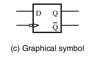

[\<- Latches](12.md)

---

# Flip-flops

## Motivation for flip-flops

### Counting

- A common example of a sequential circuit
	- We'll learn later how this really works

### Time, and gate delays

- All the timing diagrams we have seen show the output change as soon as the inputs change
	- Not reality but often a fine abstraction when we only care about logical behavior
- In reality, it takes some amount of time for a change in an input to "propagate" to a change in the output
	- This form of propagation delay is called gate delay

### Pass-thru effects

- With a latch, the output can change for the entire time the CLK is asserted
- What happens if next count logic is "faster" than the time CLK is high?
	- Uneven counting, probably not what we want

### Avoiding pass-thru effects

- We could shrink the time that CLK is high, but this becomes impractical
	- Circuitry to generate and distribute CLK is cleaner if high and low phases are equal
- Use circuit structures that are designed to react to just the "edge" of the clock
	- Output can only change when CLK goes from low to high (rising edge) or high to low (falling edge)
	- We call these circuits flip-flops

---

## Master/slave latch

- Note how the clock "port" is drawn

- The output Q can only change at the "edge" of the clock (the negative edge)

---

## Positive edge-triggered flip-flop

- A more efficient design than master/slave

### How does it work?

- When clock is low
	- P1 and P2 are high, isolating Q/!Q
	- P3 is the same as D and P4 is !D
- As soon as Clock goes high
	- If P3 is high (i.e., D is 1)
		- P1 goes low, setting Q to 1
		- Gates 1 and 3 are disabled, P4 doesn't matter
	- If P4 is high (i.e., D is 0)
		- P2 goes low, resetting Q to 0
		- Gate 4 is disabled, D doesn't matter
- When Clock goes low, P1 and P2 go to 1

---

## Summary of latch/flip-flop behavior

### Latch vs flip-flops

### Analogies

- A latch is like a door:
	- When CLK is high, the door is open
		- Q does whatever D does while the door is open
	- When CLK goes low, the door shuts
		- Q "latches" onto whatever value was on D when the door shut
- A flip-flop is like a camera
	- Q is a picture of whatever is on D at the relevant edge (positive edge or negative edge)
	- Q \*cannot\* change until the next relevant edge

### Setup and Hold Time

- The output "latches" when the CLK transitions (waveform is neg-edge trigger)
- If D changes close to this time, you might not get a stable output
	- Like taking a picture and the subject moves

---

[Sequential design using flip-flops ->](14.md)
