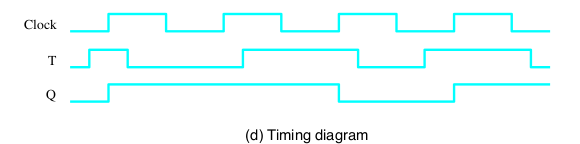

[\<- Flip-flops](13.md)

# Sequential design using flip-flops

## Concepts for sequential design

### Picturing a sequence

### Sequential Design Concepts

- The time from one rising edge of the clock to the next is called a cycle
- With positive edge-triggered flip-flops, the output can only change at the rising edge of the clock
	- The flop output (Q) is in a stable "state" for an entire cycle
- The flop changes state depending on what's on the input (D) at the next rising edge of the clock

### Using these concepts

- Time (past, present. future) is viewed in terms of cycles
- Inputs can change over time
	- What matters is the input values "now"
	- "Now: is the current cycle
- The next state value, D, is a function of the current state, Q, and the current inputs to the circuit

---

## Circuit that behaves like a T flip-flop

### The T flip-flop

- The flip-flop we have covered thus far is a D flip-flop
	- It is the most common type of flip-flop, but we will also cover other types of flip-flops
- A T flip-flop toggles (flips) state if T=1 at the rising edge of the clock
	- How to implement this behavior with a D flip-flop?
	- Need to define logic to generate the D input of the flop as a function of the control signal (T) and the flop's current state (Q)
	- A 2-input truth table

### Circuit that behaves like T ff

- T is the input of the entire circuit
- Need to define logic to control D input

|TQ|D|
|--|-|
|00|0|
|01|1|
|10|1|
|11|0|

### T behavior using D flip-flop

---

## JK flip-flop

- A JK flip-flop is a combo of S, R, and T
	- J sets, K resets, asserting both toggles

|JKQ|D|
|---|-|
|000|0|
|001|1|
|010|0|
|011|0|
|100|1|
|101|1|
|110|1|
|111|0|

### JK behavior using D flip-flop

---

[Datapath concepts: buses, registers, multi-bit muxes, shift registers ->](15.md)
