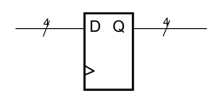
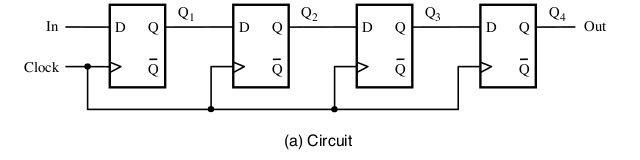

[\<- Sequential design basics](14.md)

---

# Datapath concepts: buses, registers, multi-bit muxes, shift registers

## Buses and registers

### Datapath elements

- Before we get into more sequential design, taking a detour to learn some concepts/abstractions/terminology associated with multi-bit values
	- Buses
	- Registers
	- Multi-bit muxes
- Also a good time to learn some more Verilog before returning to sequential design

### What is a bus?

- A set of wires generally treated as a single entity
- Often expressed/labeled like an array of wires
	- E.g., data[31:0]
		- Range from 31 to 0 (encompasses 32 values)
		- Represents a bus called data that has 32 individual bits/values (32 bit bus)
	- Each index denotes a different wire
- Schematic notation uses a slash and a number to indicate bus "width"
	- The below diagram represents a 4 bit bus

### Registers

- A group of flip-flops used to store the individual bits of some multi-bit value
	- E.g., a 32-bit register is a group of 32 flip-flops, with each flop holding one of the 32 bits
- Schematic representation is a flip-flop with buses connected to the input and output
	- Bus width implies the number of flip-flops

---

## Load enables

- There is \*always\* a value on the D input of a register; wires always have a value
	- There may be times when it is undesirable for that value to be captured in the register
- If a bus connects to a number of registers, you want to control which one loads data
	- `E` is the load enable input in the diagram below

### Register w/load enable

- Previous pictures intended to show concept in detail, i.e., how it works
- Abstraction just uses E to represent load enable capability
	- The muxing or clock gating is implied
- This 8-bit register just needs to show one enable (E)

### Load enable usage example

- ALU takes two input operands to generate a result
- What if we just had one bus to get the operands to the ALU?
	- Use registers to hold the operands
	- Use load enables to control when the value on the bus is loaded into which register
- Maybe the result gets captured in a register, but only if the answer is correct
	- Another use of the load enable concept

### Block diagram w/load enables

- Datapath with controls

---

## Multi-bit muxes

- We've seen buses, which are actually multiple wires
- We've seen registers, which are multiple flip-flops
- Multiplexers are also often multi-bit
	- Drawn as a single instance in a schematic
	- Bused data inputs and outputs imply multiple instances
	- Select signals still a function of the number of choices, \*not\* the width of the data buses

### 8-bit wide 4:1 mux

---

## Shift register concept

- A special type of register that chains the flip-flops together so that bits can move position
- Uses:
	- multiplying/dividing by 2
	- a type of counter
	- tracking the position of an object
	- serial \<-> parallel conversion

### Basic Shift Register

### Loadable shift register

- Can either shift right, or load a set of 4 bits at one time
	- Parallel inputs: D3, D2, D1, D0

---

## Universal shift register

### Other shift register functions

- Previous example had "shift right" and "load" functions
- Other functions could be "shift left" and "hold"
	- hold = don't change anything
- A universal shift register (USR) provides all four functions
	- What would this look like?

### One bit of the USR

- Assuming 2-bit encodings in the table

|S1S0|function   |
|----|--------   |
|00  |Shift left |
|01  |Shift right|
|10  |load       |
|11  |hold       |

---

[Procedural Verilog and specifying sequential circuits in Verilog ->](16.md)
