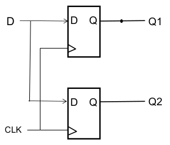
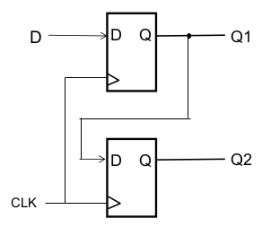
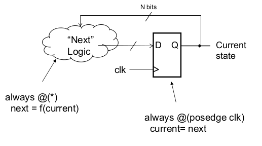

[\<- Datapath concepts : buses, registers, multi-bit muxes, shift registers](15.md)

---

# Procedural Verilog and specifying sequential circuits in Verilog

## Conditional assignment

- Mux can be modeled as a conditional assign statement
	- Mux select is condition
	- "Port1" listed first

```
module mux2to1(20, 21, s, f);
	input w0, w1, s;
	output f;

	assign f = s ? w1 : w0;

endmodule
```

---

## "Always" block concepts

### Strange concepts ahead

- The next topic we will be looking at is the concept of procedural statements
	- Often referred to as an "always" block because it starts with the keyword "always"
- Can be a difficult concept to wrap your head around
	- Prime example of the idiosyncrasies of how Verilog was developed
- Once you get the hang of it, makes Verilog so much easier to specify complex circuits
- Always keep in mind that we are **describing hardware**, not writing software code

### The always block

- Assign statements are a relatively direct modeling of hardware concepts
- Always block allows for specifying functionality in a high-level fashion
	- Simulation tools interpret the behavior
	- Synthesis tools translate into an implementation structure
		- Quartus doesn't implement structure you specify
- Code inside block evaluated sequentially
- Use of begin/end for multiple statements

### Sensitivity list

- Most uses of always block use an `@` construct to indicate when block should be evaluated
	- Called the sensitivity list
- Might be easier to think of "always" as "whenever"
- For combinational logic, needs to list all inputs to the logic
	- Originally required complete listing
	- At some point, `*` (wildcard) was added as a convenience

### The "reg" variable type

- As with other languages, variables are set to values when on left of equal sign
	- `A = B & C`
- Sometimes an always block doesn't execute
	- Conditions in sensitivity list not met
- Simulator needs to maintain variable settings from the last time the always block \*did\* execute
	- Led to requiring variables to be of type "reg"

---

### If-statement examples

### Mux with if-else statement

- If-else construct doesn't as obviously match a hardware structure, but is useful for specifying behavior
- `f` is defined as reg, as well as output
	- It needs to be declared as reg because it is being used in the always block

```
module mux2to1(w0, w1, s, f);
	input w0, w1, s;
	output reg f;

	always @(w0, w1, s)
		if (s==0)
			f = w0;
		else
			f = w1;
	
endmodule
```

### A few other constructs

- Buses are like arrays
	- wire [1:0] S; (or [0:1] S)
	- Individual bits/wires can be identified: S[1]
- Buses can be "created" by concatenation
	- S[1:0] = {S1, S0}
- Specifying constants: \<n\>'b\<bit pattern\>
	- 2'b11
	- Can also do 4'hF (== 4'b1111)
	- n is the number of bits, not the # of digits
	- b vs h indicates format of constant (binary vs hex)

### 4:1 mux using always @(\*)

- The wildcard is used in place of listing out all our inputs

```
module mux4to1(w0, w1, w2, w3, S, f);
	input w0, w1, w2, w3;
	input [1:0] S;
	output reg f;

	always @(*)
		if(S == 2'b00)
			f = w0;
		else if(S == 2'b01)
			f = w1;
		else if (S == 2'b10)
			f = w2;
		else if (S == 2'b11)
			f = w3;

endmodule
```

### Bus enumeration

- Example of both styles: 0:3 and 1:0

```
module mux4to1(W, S, f);
	input [0:3] W;
	input [1:0] S;
	output reg f;

	always @(W, S)
		if(S == 0)
			f = W[0];
		else if(S == 1)
			f = W[1];
		else if (S == 2)
			f = W[2];
		else if (S == 3)
			f = W[3];

endmodule
```

---

## Case-statement examples

### The case statement

- Each 'if' clause is checking for a different value of S
- Case statement allows for a more efficient way to specify:

```
always @(*)
	case (S)
		0: f=W[0];
		1: f=W[1];
		2: f=W[2];
		3: f=W[3];
	endcase
```

### Another case example

- Concatenation operator dynamically creates a 3-bit variable
- Default case can be used to catch all other cases

```
module dec2to4(W, En, Y);
	input [1:0] W;
	input En;
	output reg [0:3] Y;

	always @(W, En)
		case({En, W})
			3'b100: Y = 4'b1000;
			3'b101: Y = 4'b0100;
			3'b110: Y = 4'b0010;
			3'b111: Y = 4'b0001;
			default: Y = 4'b0000;
		endcase;

endmodule
```

- Remember: the curly braces represent concatenation (which means that the case argument is actually a 3-bit number)

### More on case statements

- Previous case statement could have been written

```
if(En==1 & W==2'b00) Y = 4'b1000;
else if(En==1 & W==2'b01) Y = 4'b0100;
else if(En==1 & W==2'b10) Y = 4'b0010;
else if(En==1 & W==2;b11) Y = 4'b0001;
else Y = 4'b0000;
```

- If all possible cases not listed, need default

### One more example

- The ALU we looked at had two mux'ing circuits:
	- selective inversion for operand B
	- selection for the final result to be either the output of the adder or a true/false indication
- How to implement these as case statements, using the 2-bit command as the selection quantity?
	- In place of F1,F0, let's use Command[1:0]

### Example usage of case

- If specifying ALU in Verilog, Result could be set in a case statement

```
Always @(*)
	case(Command)
		2'b00: Result = Sum;
		2'b01: Result = Sum;
		2'b11: Result = {0,0,0,LT};
		default: Result = Sum;
	endcase
```

---

## Modeling a flip-flop

- Use edge of clock in sensitivity list
	- Models the snapshot behavior of a flop
	- No reason to execute the code except for when there's a rising edge

```
module flipflop(D, Clock, Q);
	input D, Clock;
	output reg Q;

	always @(posedge Clock)
		Q = D;

endmodule
```

- `posedge` is a keyword in Verilog
	- We use it in the above example to say that our flip-flop is a positive edge trigger

---

## The subtlety of non-blocking assignments

### Multiple flops in the same block

- Because always block is evaluated sequentially, need to make sure behavior is as intended
	- Both Q1 and Q2 would get D in this example

```
module example5_3(D, Clock, Q1, Q2);
	input D, Clock;
	output reg Q1, Q2;

	always @(posedge Clock)
	begin
		Q1 = D;
		Q2 = Q1;
	end

endmodule
```



### Non-blocking statements

- Forces simulator to update in parallel
- Generally used when modeling flops
	- Doesn't make a difference in simple designs
	- Multiple interacting synchronous modules

```
module example5_4(D, Clock, Q1, Q2);
	input D, Clock;
	output reg Q1, Q2;

	always @(posedge Clock)
	begin
		Q1 <= D;
		Q2 <= Q1;
	end

endmodule
```



- `<=` is the non-blocking statement
	- It looks like at less than or equal to sign, but it is supposed to represent more of an arrow to the left
	- Purpose is to use over `=` in the above example because it assigns to `Q2` the value of `Q1` before it was set to the value of `D` (non-sequential) (as opposed to setting `Q2` to the value of `Q1` after it was set to the value of `D`)
	- Good practice to use

---

## Modeling a register, with load enable

### Modeling registers

- Registers are just multi-bit flip-flops
	- Buses for inputs and outputs
- Load enables control updates
	- But not in sensitivity list, just posedge clock

```
Module fourBitReg(D, clock, En, Q);
	input [3:0] D;
	input En, clock;
	Output reg [3:0] Q;

	Always @(posedge clock)
		if(En) Q = D;

Endmodule
```

---

## Separating combinational logic from state updates

### A note about usage of always

- There are multiple ways to specify sequential circuits in Verilog
- For our sanity, we will use two always blocks to avoid confusion
	- One for combinational logic (`always @(*)`)
		- Causes simulator to evaluate whenever an input changes
	- One for flip-flops (`always @(posedge clk)`)
		- Causes simulator to only evaluate at the clock edge, since that's the only time the output can change

### Verilog for sequential circuits

- Combinational logic generates "next" value as a function of "current" value
- Flip-flops update "current" value with "next"



---

[Counters ->](17.md)
