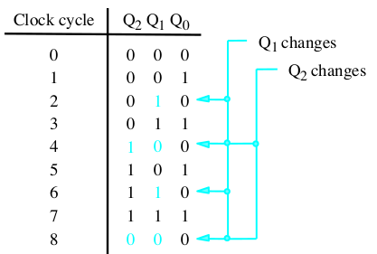
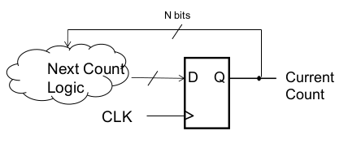
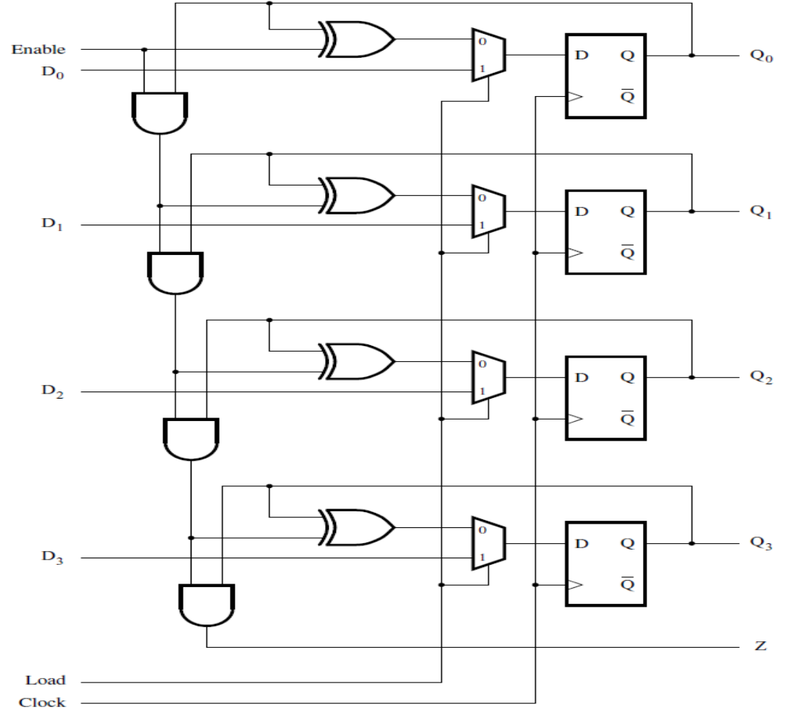
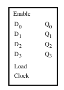
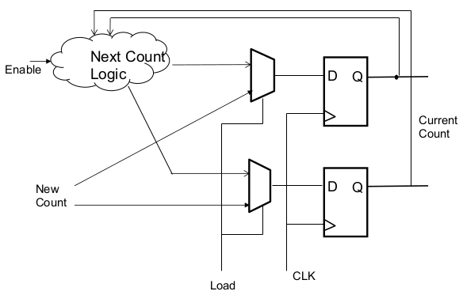
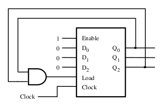
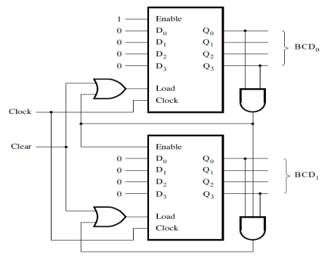

[\<- Procedural Verilog and specifying sequential circuits in Verilog](16.md)

---

# Counters

## Counter concepts

### What is a counter?

- Multi-bit state to represent a count value
- Every cycle the count changes (possibly)
	- "Normal" counting adds 1 each cycle
	- Count value "wraps" around to 0 after max \#
		- In the below example, the max \# is 7, as it goes back to zero when it goes from 7 to 8

- The above diagram is **not** a truth table

### Designing a counter

- Same sequential design concepts
	- Define logic to generate inputs to flops
	- Current count value is the input to the logic
	- Next count value is the output => flop inputs

### Designing the logic

- Truth table for "next count" logic
	- N-bit counter has 2^N rows
	- Input is Q, output is D
	- For each row, output is the next value in the sequence

|Q2Q1Q0|D2D1D0|
|------|------|
|000   |001   |
|001   |010   |
|010   |011   |
|011   |100   |
|100   |101   |
|101   |110   |
|110   |111   |
|111   |000   |

---

## "Abnormal" counting

- Works for any type of counting
	- Count by 1, 2, up, down, etc.
	- Different ranges (start and end points)
		- Use don't cares for values not in range
- Counting from 0 to 5 means going back to 0 once 5 is reached
	- 6 and 7 are don't cares

|Q2Q1Q0|D2D1D0|
|------|------|
|000   |001   |
|001   |010   |
|010   |011   |
|011   |100   |
|100   |101   |
|101   |000   |
|110   |ddd   |
|111   |ddd   |

### Another example: count by 3

- Sequence is 000, 011, 001, 100, 111, 010, 101, 000, etc.
- Note the left hand side of the truth table is \*exactly\* like any other 3-input table

|Q2Q1Q0|D2D1D0|
|------|------|
|000   |011   |
|001   |100   |
|010   |101   |
|011   |110   |
|100   |111   |
|101   |000   |
|110   |001   |
|111   |010   |

---

## Counter controls: count enable and parallel load

### Counter controls

- Count enables are common
	- Stop counting but hold the current value
	- Can be factored into input logic or tied to "embedded" load enable
- Parallel load allows counter to start at a certain value
	- Needs a mux to select between next count value and new value to load
- Combination of the two (count enable and parallel load) can be done in different ways

### Count Enable & Parallel Load

---

## The abstraction of a counter

- Because counters are common, they are often represented in larger circuits as an abstraction
	- Typically count by 1, full range, and wrap
	- As with other abstractions, once we've learned how they work on the inside, it's useful to be able to step away from the details

### A loadable counter

- An intermediate-level abstraction to help think about how a loadable counter works

---

## Using/re-purposing a counter

### Repurposing a counter

- Using a 3-bit counter abstraction
	- Normally counts from 0 to 7 (modulo 8)
- Modify it to count from 0 to 5 (modulo 6)
	- Parallel load 0 when the count reaches 5
- In this example, count is always enabled

### A BCD Counter

- Binary-coded-decimal counts from 0 to 9
- Second digit counts when first reaches 9

---

## Summary: designing from scratch vs re-purposing

### From scratch vs repurposing

- From scratch means creating the truth table and working out the logic yourself
- Re-purposing means using a counter that has already been designed, and taking advantage of the provided control signals, like parallel load and count enable
	- Control signals (inputs) \*must\* be set to something, cannot be left hanging

---

[State machine concepts ->](18.md)
