[\<- Counters](17.md)

---

# State machine concepts

### Extending Sequential Design

- State maintained by flops
- Next state a function of current state and inputs
- Outputs are a function of current state, and possibly current inputs

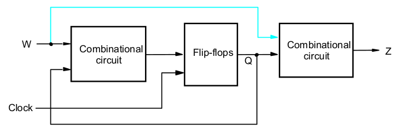

### Tackling state machines

- Like word problems in math
- Clearly define inputs and outputs
	- Make sure you understand what each signal means
- How does time affect the behavior of the output?
	- The present is a function of the past
	- The past is what has happened in previous cycles
	- What information from the past needs to be tracked?

### State diagrams

- How we capture/specify desired behavior
- State "bubbles" represent "where are we?"
	- Output value listed in state
- Arcs/arrows indicate where to go next
	- Need an arc for every possible input condition
	- Can go to previous state, stay in current state, or go to new state

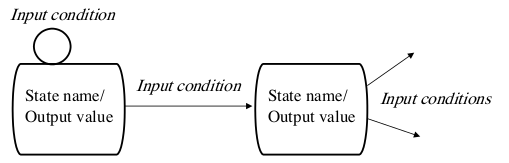

---

## State diagram for simple sequence detector

### Example 1

- Assert output if input asserted for at least two cycles
- Hold the output asserted until the input de-asserts
- Since the output is a function of what has happened in previous cycles, need stateful tracking of the input sequence

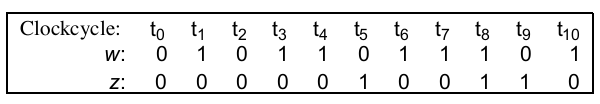

### Step 1

- Every cycle, evaluate input to determine what state to move to next
- Initial State (A), to indicate sequence hasn't started
	- Output (z) is 0, since we haven't seen the pattern
	- Stay here until the first assertion is seen
		- As long as w=0

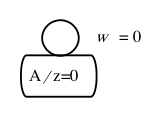

### Step 2

- If w is asserted, we need to add a state (B) to keep track of the fact that this has happened
	- But Z is still 0 because we haven't seen the pattern yet
- Need to evaluate input conditions relative to state B, since time has passed into a new cycle

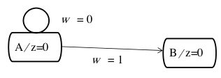

### Step 3

- State B represents "w was asserted the previous cycle"
	- What is w doing this cycle?
- If w is 0, sequence is broken, go back to A
- If w is 1, we've now seen two 1's in a row
	- That's our pattern, need a new state (C) so that we can assert z

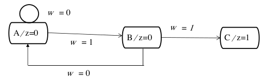

### Step 4

- We're not done yet, we still need to evaluate state C for the different input conditions
	- If w stays 1, we can stay in state C
	- If w deasserts, go back to state A
- No new states means now we're done

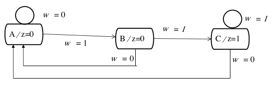

---

## Translating from state diagram to state table, with state assignments

### Translate diagram into table

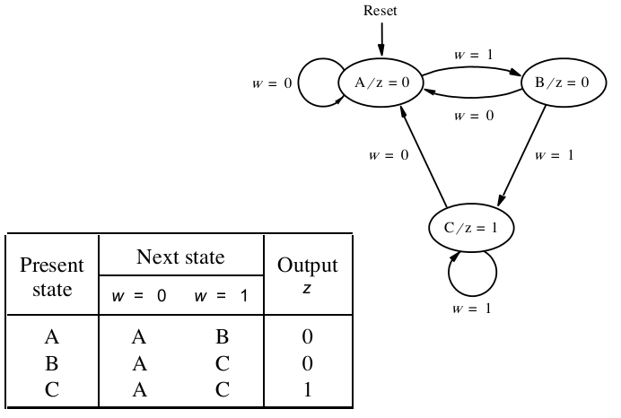

### Implementation Structure

- Three states means we need 2 flops

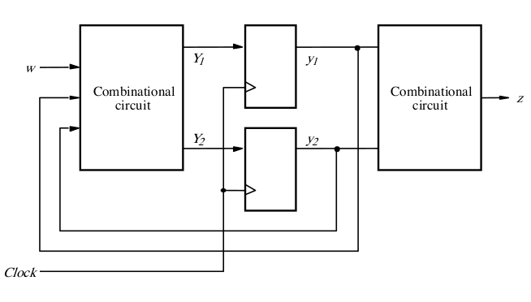

### State Assignment

- Define which flop encoding is associated with which state
	- Encodings don't matter, as long as each state has a unique value

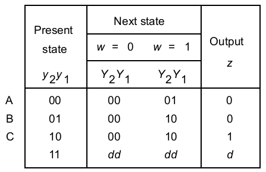

---

## Next state and output equations

### Interpreting the state table

- State table is a different format of truth table
	- Present/current state and control inputs are the "inputs"
	- Next state values are the "outputs"

|wy2y1|Y2Y1|
|-----|----|
|000  |00  |
|001  |00  |
|010  |00  |
|011  |dd  |
|100  |01  |
|101  |10  |
|110  |10  |
|111  |dd  |

### Next state equations

- Every state flop needs its own logic equation for its D input
	- Can take a minterm-like approach, or use K-maps, or take any other approach that works

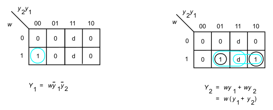

### Output equation

- Also need equation for z
- Note that we don't typically take the extra step of creating a truth table, but it's an option if you can't derive the logic from the state table directly

|y2y1|z|
|----|-|
|00  |0|
|01  |0|
|10  |1|
|11  |d|

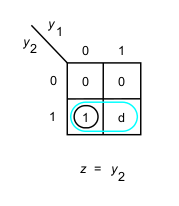

### Implementation

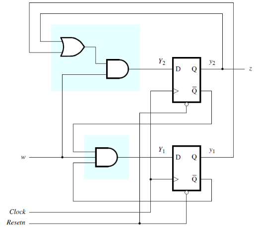

### Timing Diagram

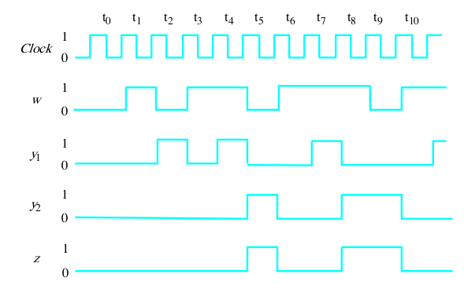

### Summary of Steps

1. Obtain the specification of the desired circuit
2. Derive a state diagram
3. Derive the corresponding state table
4. Decide on the number of state variables
5. Derive the logic expressions needed to implement the circuit

---

## Another sequence detector

- Let's say we wanted to detect a slightly more complex pattern: 101
- We need to detect all embedded sequences
	- 10101 and 101101 both have two instances of 101 embedded in them
- Need to think about how each input fits into a larger possible sequence

### State diagram to detect 101

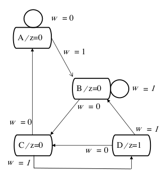
