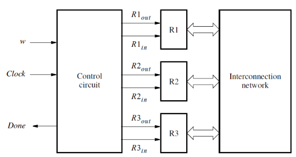
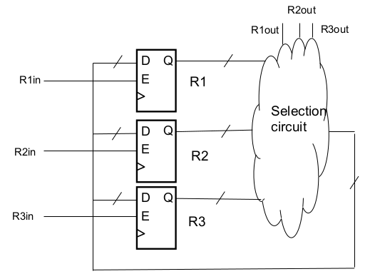
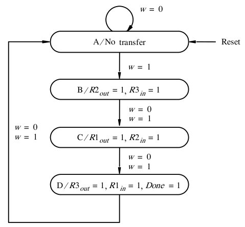
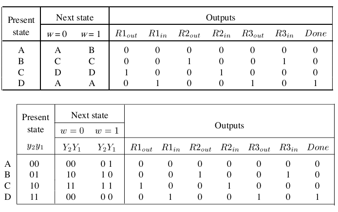
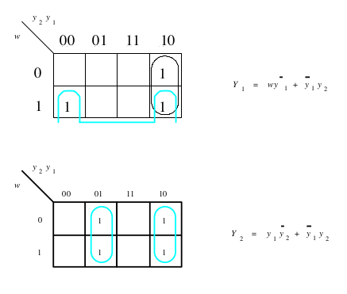
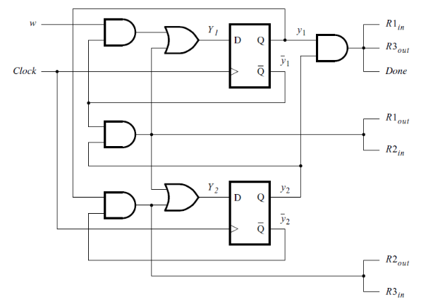

[\<- State machine concepts](18.md)

---

# Multiple control outputs

## Background on register swap problem

### Datapath and control

- We've learned about muxes and registers as datapath elements
- Mux selects and load enables are control signals that determine how datapath is used
- If these control signals need to be sequenced across multiple cycles, a state machine is the typical way to do this

### Example 2: Register Swap

- Swap the contents of R1 and R2
- Can't be done in a single cycle
- Use R3 as temporary holding register

### Another view of the datapath

- To make the control signals more clear

---

## State diagram

### Sequence

- Since there's a single bus, can only copy/move one value at a time
	- Copy the value in R2 into R3
		- Select R2 to drive the bus and assert R3's enable
	- Copy the value in R1 into R2
		- Select R1 to drive the bus and assert R2's enable
	- Copy the value in R3 into R1
		- Select R3 to drive the bus and assert R1's enable
- Each of these steps is a different state in a state machine

---

## State table and implementation

### State Table & Assignment

### Visually deriving equations

- Y2 = (stateB) + (stateC)
	- `= !y2*y2 + y2*!y1 = y2^y1`
- Y1 = w\*(stateA) + (stateC)
	- `= w*!y2*!y1 + y2*!y1`

### K-maps for Next State

### Implementation

---

[1-hot encoding and State machines in Verilog ->](20.md)
