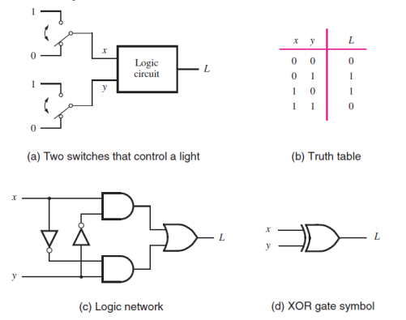
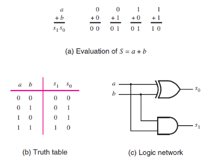
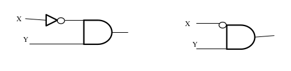
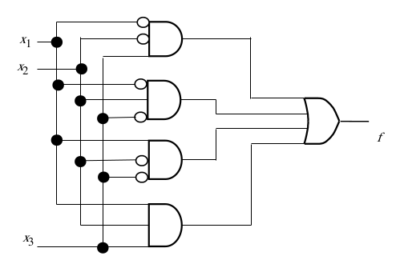

[\<- Digital Hardware and Logic Gates](1.md)

---

# Truth Tables, minterms, and simple synthesis

## Truth Tables

- The fundamental way to capture desired behavior of a logic function
- Inputs on the left, output(s) on the right
	- Variable names are an abstraction
- Each row is a unique combination of inputs
	- A 2-input table has four (2^2) rows
	- A 3-input table has eight (2^3) rows
- The output in a given row is the desired behavior for the input values specified in that row

### Truth Table structure

- Rows are listed in counting order, covering all possible input combinations
- Every input needs a value
	- Leading zero's

|X1X2X3|F (Output)|
|------|-|
|000   | |
|001   | |
|010   | |
|011   | |
|100   | |
|101   | |
|110   | |
|111   | |

### Truth Table for AND and OR

- Note: we list input combinations in "counting" order

|x1|x2| |x1 * x2 (AND)|x1 + x2 (OR)|
|--|--|-|-------------|------------|
|0 |0 | |0            |0           |
|0 |1 | |0            |1           |
|1 |0 | |0            |1           |
|1 |1 | |1            |1           |

---

## The XOR Gate

### The Exclusive-OR (XOR) Gate

- Not as fundamental as AND/OR/NOT, but extremely common

---

## Analysis vs. Synthesis

- "What does this circuit do?" vs "I want a circuit that does this"
- Analysis is the process of generating **the** truth table for a given circuit
- Synthesis is the process of generating **a** circuit based on a truth table (or just knowing what you want the circuit to do)
	- Two different circuits can yield the same result
	- We will learn different synthesis techniques

### Synthesis by recognition

- These functions (s1 and s0) happen to match a single gate implementations
	- Not typical; we'll learn more synthesis tools

---

## Product Terms

- An application of the AND function
	- Since we model AND as multiplication
- Evaluates tot true only if **all** inputs are true
	- Allows for "detection" of a specific set of conditions (i.e., input values)
- Inputs can be inverted to detect 0's
- Examples:
	- `X*Y` is true only if `X=1` AND `Y=1`
	- `X*!Y` is true only if `X=1` AND `Y=0`

### Product terms in schematics

- We will be using product terms a lot
- Don't always need to draw inverters
	- A bubble implies the presence of an inverter
- Two different ways to draw `!X*Y`:

---

## Minterms and the canonical SOP

### Minterms (and maxterms)

- A product term that uses all inputs
	- A row in the truth table
- Enumerated by input values

|Row number|x1|x2|x3| |Minterm             |Maxterm             |
|----------|--|--|--|-|--------------------|--------------------|
|0         |0 |0 |0 | |m0 = !x1 * !x2 * !x3|M0 =  x1 +  x2 +  x3|
|1         |0 |0 |1 | |m1 = !x1 * !x2 *  x3|M1 =  x1 +  x2 + !x3|
|2         |0 |1 |0 | |m2 = !x1 *  x2 * !x3|M2 =  x1 + !x2 +  x3|
|3         |0 |1 |1 | |m3 = !x1 *  x2 *  x3|M3 =  x1 + !x2 + !x3|
|4         |1 |0 |0 | |m4 =  x1 * !x2 * !x3|M4 = !x1 +  x2 +  x3|
|5         |1 |0 |1 | |m5 =  x1 * !x2 *  x3|M5 = !x1 +  x2 + !x3|
|6         |1 |1 |0 | |m6 =  x1 *  x2 * !x3|M6 = !x1 + !x2 +  x3|
|7         |1 |1 |1 | |m7 =  x1 *  x2 *  x3|M7 = !x1 + !x2 + !x3|

### Synthesis with Minterms

- Identify all minterms where the output is 1
	- In table below; m1, m4, m5, m6
- "Add" them together to create a sum of products (SOP) equation
	- F = m1 + m4 + m5 + m6

|Row number|x1|x2|x3| |f(x1, x2, x3)|
|----------|--|--|--|-|-------------|
|0         |0 |0 |0 | |0            |
|1         |0 |0 |1 | |1            |
|2         |0 |1 |0 | |0            |
|3         |0 |1 |1 | |0            |
|4         |1 |0 |0 | |1            |
|5         |1 |0 |1 | |1            |
|6         |1 |1 |0 | |1            |
|7         |1 |1 |1 | |0            |

### Canonical SOP equation

- Continuing from previous section, we had
	- F = m1 + m4 + m5 + m6
- But m1, m4, m5, and m6 are really product terms of the acutal inputs
- The full equation, using actual inputs
	- `F = (!x1 * !x2 * !x3) + (x1 * !x2 * !x3) + (x1 * !x2 * x3) + (x1 * x2 * !x3)`
- The canonical SOP equation is explicitly the sum of the minterms

### Shorthand for canonical SOP

- Sigma notation -> sum of minterms
- E.g., `F(x1, x2, x3) =	Σm(2,4,6,7)`
	- Note this is different function than previous ex.
	- Order of input variables matters!

|Row #|Minterm        |F(x1, x2, x3)|
|-----|---------------|-------------|
|0    |!x1 * !x2 * !x3|0            |
|1    |!x1 * !x2 *  x3|0            |
|2    |!x1 *  x2 * !x3|1            |
|3    |!x1 *  x2 *  x3|0            |
|4    | x1 * !x2 * !x3|1            |
|5    | x1 * !x2 *  x3|0            |
|6    | x1 *  x2 * !x3|1            |
|7    | x1 *  x2 *  x3|1            |

---

## 3-way Light Switch Design example

- Three inputs, corresponding to three light switches
	- A 0 means that switch is down, a 1 means up
- Toggling any switch will toggle whether the light is on or off
	- All down -> light off
	- Any one up -> light on
	- Any two up -> light off
	- All three up -> light on

### Express as truth table

- A 3-input function has 8 rows, and the rows enumerate the input combinations

|x1|x2|x3| |f|
|--|--|--|-|-|
|0 |0 |0 | |0|
|0 |0 |1 | |1|
|0 |1 |0 | |1|
|0 |1 |1 | |0|
|1 |0 |0 | |1|
|1 |0 |1 | |0|
|1 |1 |0 | |0|
|1 |1 |1 | |1|

### Synthesize

- Need to "add" minterms 1,2,3, and 7
	- `F = 	Σm(1,2,4,7)`
	- `F = (!x1 * !x2 * x3) + (!x1 * x2 * !x3) + (x1 * !x2 * !x3) + (x1 * x2 * x3)`
- A valid synthesis, but there are multiple ways to synthesize the same truth table
- Before we look at others, we need to understand more about Boolean algebra
	- Boolean means variables can only be 1 or 0

### Schematic

- Wires can get "busy", i.e., hard to follow
- Connections by label is typical

---

[Boolean Algebra and DeMorgan's Theorem ->](3.md)
