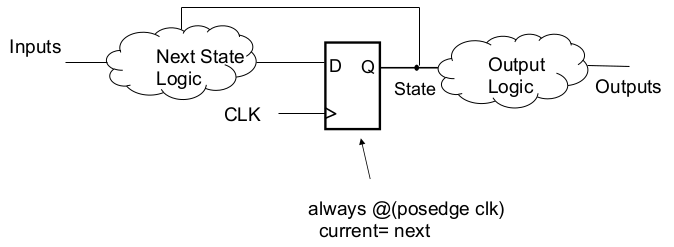
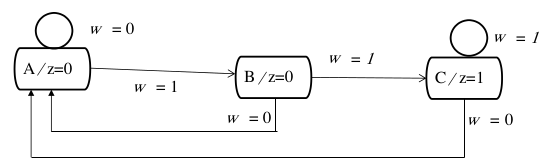

[\<- Multiple control outputs](19.md)

---

# 1-hot encoding and State machines in Verilog

## 1-hot encoding

- Requires more flops, one for each state
- Next state and output equations can be more directly identified
- One-hot version of example 1:
	- `Y1 = !w`, `Y2 = w*y1`, `Y3 = w*(y3+y2)`, `z = y3`


- Number of bits = number of unique states

### One-Hot Version of Example 2

- K-map would be 5 variable, or just
	- `Y4 = y3`
	- `Y3 = y2`
	- `Y2 = w*y1`
	- `Y1 = y4+!w*y1`
	- `R1out = R2 = y3`
	- `R1in = R3out = Done = y4`
	- `R2out = R3in = y2`


---

## Structuring Verilog for a state machine

- Combinational logic to
	- generate "next" value as a function fo "current" value and inputs
	- generate outputs
- Flip-flops update "current" value with "next"



### Variable declarations

- The inputs, outputs, and clock will already be covered by the interface definition
- Need variables for current state and next state
	- Current state needs to be type "reg"
	- If we describe next state logic in an always block, also needs to be type "reg"
- Need to know how many bits, to accommodate state assignments
	- `reg [1:0] cState, nState; // defines 2-bit state`

---

## Writing code for the "next state" logic

### Structuring state updates

- Useful to separate flops (i.e., state) from combinational logic that generates next state
	- Flops under `always @(posedge clk)`
- Next state equations can be translated into code, either `assign` or `always @(*)`
- Or, use a case statement (inside always)
	- For each case/state, determine next state as a function of control inputs

### Case statement for example 1

- Assuming state assignments 00, 01, 10

```
always @(*)
	case(cState)
		2'b00: if(w) nState=2'b01; else nState=2'b00;
		2'b01: if(w) nState=2'b10; else nState=2'b00;
		2'b10: if(w) nState=2'b10; else nState=2'b00;
		default: nState=2'b00;
	endcase
```



---

## Other pieces: output logic, reset, and the parameter statement

### Output logic

- In this state machine, just a single output (z), which asserts when we're in state C
- A simple assign statement will do the trick:
	- `assign z = cState[1] & !cState[0];`
	- or `assign z = (cState == 2'b10);`

### Resetting the state machine

- Note the circular dependence in a sequential desing:
	- `nState = f(cState)`, `cState=f(nState)`
- When we "start", we don't know cState
- A reset signal forces a known state
	- Can be synchronous or asynchronous

```
always @(posedge clock)
	if(reset) cState = 2'b00;
	else cState = nState;
```

### Giving names to states

- State variables are necessarily binary values, but giving names to states makes code easier to write and follow
- Parameter statement associates names (text) with state assignments
	- Parameter [1:0] StateA=2'b00, StateB=2'b01, StateC=2'b10;
- Note that the "width" needs to match the width of the state varaibles (cState and nState)

---

## Putting it all together: the full sequence detector module

### Sequence detector

```
module simple(Clock, Resetn, w, z);
	input Clock, Resetn, w;
	output z;
	reg [2:1] y, Y;
	parameter [2:1] A = 2'b00, B = 2'b01, C = 2'b10;

	// Define the next state combinational circuit
	always @(w, y)
		case(y)
			A: if(w) Y = B;
			  else Y = A;
			B: if(w) Y = C;
			  else Y = A;
			C: if(w) Y = C;
			  else Y = A;
			default: Y = 2'bxx;
		endcase

	// Define the sequential block
	always @(negedge Resetn, posedge Clock)
		if(Resetn == 0) y <= A;
		else y <= Y;

	// Define output
	assign z = (y == C);

endmodule
```

---

## Changing state assignments

- Another value proposition of using parameter statement is ease of changing state assignments
- Switching to 1-hot for this design would simply involve changing 2 lines:

```
reg [2:0] y, Y;
parameter [2:0] A=3'b001, B=3'b010, C=3'b100;
```

