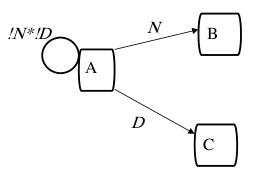
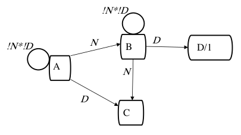
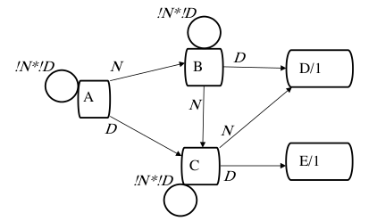
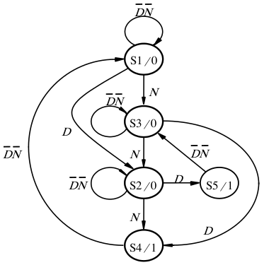
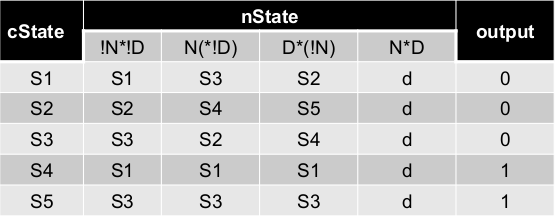

[\<- 1-hot encoding and State machines in Verilog](20.md)

---

# Multiple control inputs

## Defining and starting the vending machine example

### Adding control inputs

- So far, we've seen just one control input
- Next example is a vending machine
	- Items cost 15 cents and the machine accepts both nickles (N) and dimes (D)
	- Need to track (via states) how much money has been put in, and whether there is change
- Every state needs to account for all feasible input combinations
	- Doesn't necessarily mean a full enumeration of all possible input encodings, but solution space should be complete

### An arc for every input combo

- Start with state A, representing no money
- Stay in A as long as no money inserted
- N goes to a state (B) representing 5 cents
- D goes to a state (C), for 10 cents
- Note that N\*D can't happen, not in diagram
	- N really means N\*!D, D really means D\*!N

---

## Thinking thru the rest of the vending machine state diagram

### Now evaluate state B

- Adding possibilities from B results in adding state D, which enables output
- Note that state C represents 10 cents, whether we got there from a dime or two nickels

### Evaluating state C

- A dime inserted in state C introduces an interesting question: what to do?
	- Decision here: give them 5 cents credit
		- Needs a new state (E) to keep track of this

### Finishing Up

- Once a selection is enabled (i.e., the output is asserted), we can unconditionally transition to the next state
	- State A from state D
	- State B from state E, to give 5 cents credit

---

## State table and next state equations for 1-hot encoding

### Alternate notation

- Different state names, but same function
- Different view of the uncoditional transfers

### The state table

- Without assignments, for now
	- As a reminder: S1=0 cents, S2=10 cents, S3=5 cents, S4=15 cents, S5=20 cents
- Fully encoded states would need 3 flops
	- 5 states -> need 3 bits to get 5 unique states
- 1-hot encoding would need 5 flops

### Next state equations

- State table starts to get hard to manage
- Next state is the sum of the arcs leading to the state
- With 1-hot encoding, not too bad:
	- `D1 = Q1*!D*!N + Q4`
	- `D2 = Q1*D + Q2*!D*!N + Q3*N`
	- `D3 = Q1*N + Q3*!D*!N + Q5`
	- `D4 = Q2*N + Q3*D`
	- `D5 = Q2*D`
- Getting more complex than this is where Verilog really helps
