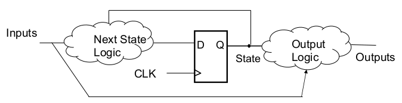
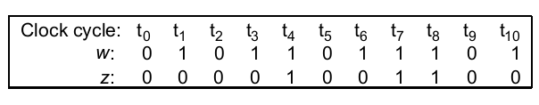
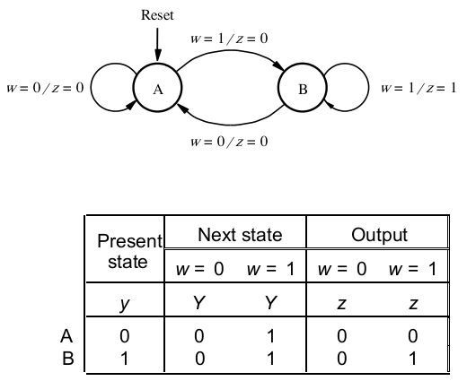
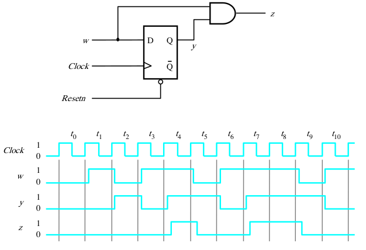
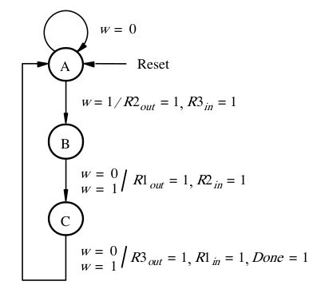
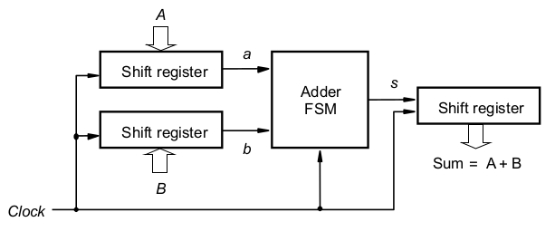
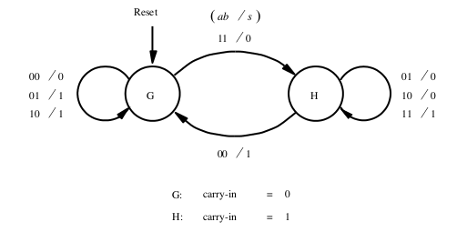
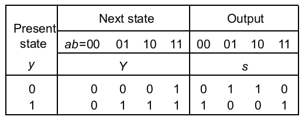

[\<- Multiple control outputs](21.md)

---

# Mealy machines

## Mealy state machine concept

### Mealy State Machine

- Often it is useful to have output to be a function of both current state \*and\* the current set of inputs
	- Called a Mealy-style state machine
	- Previous examples were Moore-style state machines; outputs are a function of only the current state



### Sequence detector, revisited

- Revisiting example 1, what if we wanted output to assert as soon as we see the second cycle of input?
	- Need output to "respond" in the same cycle as the input, not wait a cycle as we saw before



---

## Mealy state diagrams and tables



### Circuit and Timing Diagram



### State Diagram for Example 2



- Notice that the Mealy machine takes fewer states

### Mealy vs Moore

- It depends on whether we want the output to change as soon as the input changes
	- Think about a truth table for the outputs as a function of the inputs
		- Must also include some state, else not a state machine
- Consider a counter, with a count enable, as a state machine
	- When the count enable changes, do we want the count value to change

---

## Serial adder block diagram

- We learned how to do addition earlier in the quarter, and we saw how to implement and chain together full adders
- A different approach would be to do one bit-position at a time using shift registers: two operand registers and a result register
- Every cycle, shift out the lowest bits of the operands, compute the sum and shift into the result register
- Shift registers need to be loaded and shifted, but let's just focus on the addition piece



---

## Serial adder state diagram and table

### Think about the output

- If we were to try to create a truth table for 's' as a function of 'a' and 'b', could we do it?
	- Maybe for first bit, but after that it depends on whether there was a carry
	- Since carry is from the "past", it is a type of state

|ab|s|
|--|-|
|00|?|
|01|?|
|10|?|
|11|?|

### State diagram

- Note that the output is specified on the transition arcs, not in the state bubbles



### State table

- The fact that the ouputs are on the arcs means the output section needs the same structure as the next state section
	- A column for each input combination



---

## Verilog for Mealy state machines

- Generally, follow the same approach:
	- Interface: inputs a, b, clock; output s
	- State variable to differentiate the two states, defined as reg
	- Next state variable, also defined as reg
	- Separate always block for state update
		- `always @(posedge clock)`
- But, combine next state and output logic
	- Case structure is the same
	- Output must be of type reg (since now in always block)

### Example always block

```
always @(*)
begin
	nState = cState; //most scenarios stay in same state
	case(cState)
		G: begin //needed because there are 2 statements here
			if({a, b} == 2'b11) nState = H; //one exception
			s = a^b; //easier to just write equation
		end
		H: begin //same
			if(A{a, b} == 2'b00) nState=G; //another exception
			s = !(a ^ b); //equation is different than state G
		end
	endcase
end
```

### Another approach

- Have `{a, b}` be the object of the case statement

```
always @(*)
	case({a, b})
		2'b00: begin
			nState = G; s = (cState == H);
		end
		2'b01:
		2'b10: begin
			nState = cState; s = (cState == G);
		end
		2'b11: begin
			nState = H; s = (cState == H);
		end
	endcase
```

---

[Decoders and register files ->](23.md)
