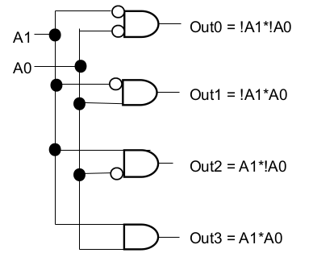
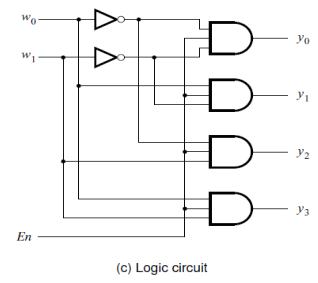
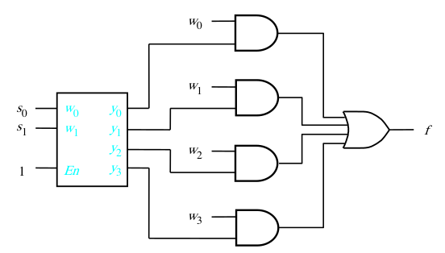
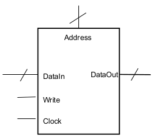
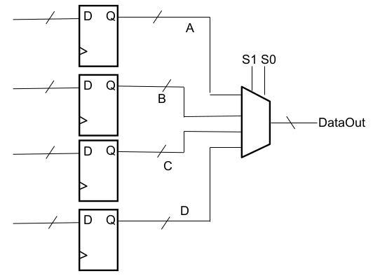
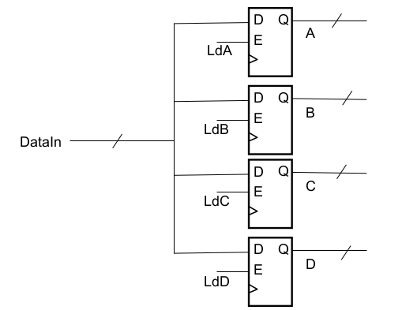
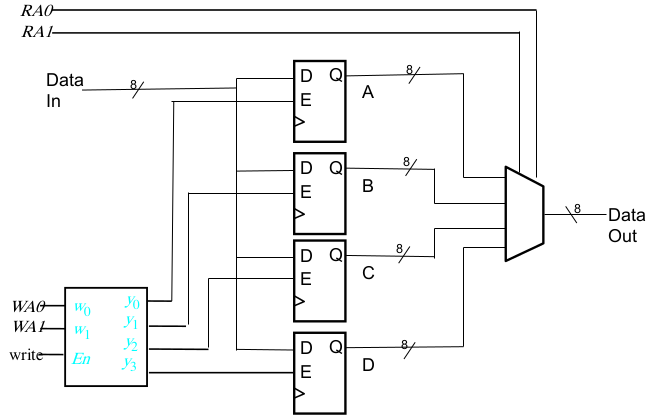
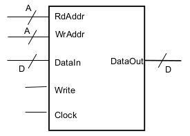

[\<- Mealy machines](22.md)

---

# Decoders and register files

## Decoders

### Decoding a multi-bit value

- An AND gate to detect each possible encoding
	- Output is 1-hot: exactly 1 output is asserted

### Decoder abstraction

- As with other abstractions, once we understand/agree on the behavior, we don't need to draw the details
- N inputs => 2^N outputs
	- Each output is being driven by an AND gate

### Decoders w/ enables

- Some applications may want to control if any output is asserted
- Can be masked via an enable/disable

### A Mux built with a Decoder

- Decode the select signals
- Use the 1-hot outputs to "pass" the selected input

---

## Register file concepts

### Storing a value in a register

- With a load enable, we can control how long a value stays in a register
	- The register "remembers" the value until we assert the load enable to cause a new value to be captured in the register
- If we have multiple values that we want to store, we need multiple registers
- Having some strucuture/organization around these multiple registers can be very useful => a register file

### Register file concepts

- A single input bus for "writing", along with a control signal to control when to "write"
- An output bus (sometimes two) for "reading"
- A means for selecting which register
	- Called an "address"
	- Sometimes there can be separate addresses for reading and writing

---

## Implementation fo a register file

### Selecting a value to "read"

- Four registers => 2-bit address

### Writing to a register

- Assert load enable, but how?

### Decoders in a register file

- In general, we only ever want to write to one register at any given time
	- Load enables want to be 1-hot
- Decoders convert an encoded input to a 1-hot output
	- Addresses are encodings
- Load enables must also account for a global write enable
	- Use as an enable to the decoder

---

## Complex example register file

- Four 8-bit registers, separate rd/wr addresses

### Summary

- Input and output data buses are same size
- Need at least one address bus and a write enable
- Address and data bus widths are \*independent\* parameters (A, D)
	- Address size depends on how many registers

---

[Tri-state buffers, RAM ->](24.md)
