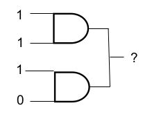
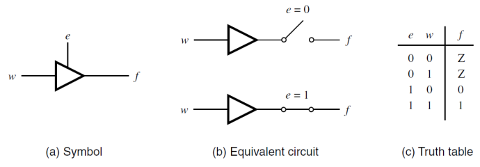
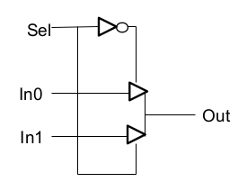
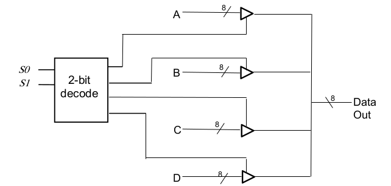
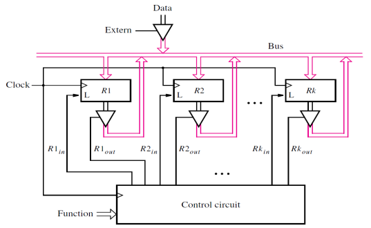
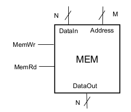
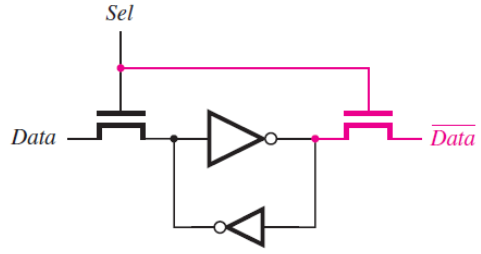
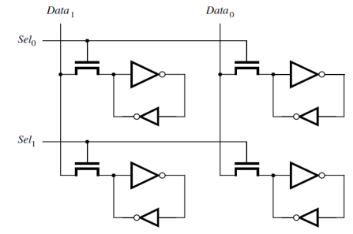
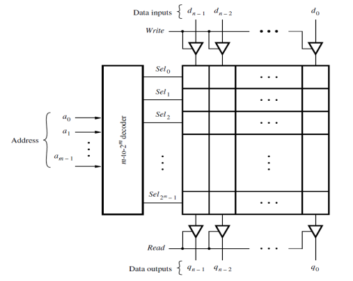
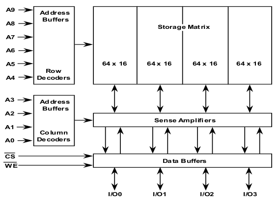

[\<- Decoders and register files](23.md)

---

# Tri-state buffers, RAM

## Tri-state buffer concept and usage for 2:1 mux

### Active outputs

- AND/OR/INV gates actively drive a 0 or 1
- We can't connect the outputs of two gates because they may want to drive different values
	- This would be bad (electrically):

### Tri-state Buffer/Driver

- When not enabled, it is no "driving" the output
- Allows connecting multiple outputs
	- As long as only one is ever enabled

- Z symbol reflects no active value on the wire (since when e=0, the wire becomes electrically disconnected)

### Muxing with tri-state buffers

- Usage of tri-state bufferis really a form of muxing
	- The input to the enabled buffer is selected to pass thru to the output
- A 2:1 mux using tri-state buffers:

---

## Using tri-state buffers for large, distributed muxes

### 1-hot buffer enables

- The key is that only 1 enable can be asserted at a time
- With four choices and 2 selects => decode

### A distributed mux

- There are four choices here, but we don't have to pull the four inputs into a localized circuit; the buffers can be "far" away

---

## The abstraction of memory

### Memory

- A large number of addressable locations
	- Just like a register file, but typically many order of magnitude larger
	- Also like a register file, the number of locations is independent of the data width
- The address is an encoded value specifying the desired location
- The structure of the memory may lead to multi-level decoding of the address

### Memory as an abstraction

- Systems with memory are usually fairly complex, so memory is typically represented as an abstraction
	- Data buses and control signals can differ
	- M address bits => 2^M locations

---

## An array of SRAM cells

### SRAM cell

- Same feedback loop as latch
	- By contrast, DRAM uses just a capacitor
- "Pass" transistors to read and write
	- Similar to tri-state buffer

### A 2x2 array of cells

- Typically connected in a regular pattern
	- Cells in a row share the same select line
	- Cells in a column share the same data line

### A block of SRAM

- Address goes thru row decoder (1-hot)

---

## Multi-level addressing of memory

### Two-level addressing

- For larger memory structures, it becomes inefficient to have just a single column of cells
- Consider an array of 1024 addressable locations, each of which is just 1-bit of data
	- 32 rows of 32 columns yields 1024 bits
	- Break 10-bit addresses into 5 bits for selecting the rows, and 5 bits to select the column
	- Similar to hotel room numbers
		- Row is like the floor, column is like the room

### A Memory Chip (1Kx4bit)

- Each sub-array stores one of the 4 bits

### More on address decoding

- Previous example showed break down into rows and columns
- Some memory chips are banked
	- Subset of address bits used to select bank
- In general, full address can be broken down into fields that enumerate/select an instance of a structure
	- E.g., 4 banks \* 128 rows \* 16 columns
	- How many address bits for each and in total?
	- Deconstruct address 0x14B7
