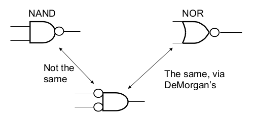

[\<- Truth tables, minterms, and simple synthesis](2.md)

---

# Boolean Algebra and DeMorgan's Theorem

## Boolean algebra basics

### Boolean Algebra Properties

- Commutative (input order doesn't matter)
	- `X*Y` = `Y*X`
	- `X+Y` = `Y+X`
- Associative (can combine like functions)
	- `X*(Y*Z)` = `(X*Y)*Z` = `X*Y*Z`
	- `X+(Y+Z)` = `(X+Y)+Z` = `X+Y+Z`
- Distributive (going the other way: factoring)
	- `X * (Y+Z)` = `X*Y + X*Z`
- Combining
	- `X * Y + X * !Y` = `X * (Y + !Y)` = `X`

---

## DeMorgan's Theorem

- `!(X*Y)` = `!X + !Y` (and `!(X+Y)` = `!X * !Y`)
- Allows us to transform any AND gate to an OR gate, or vice versa
- NOTE: `!(X*Y)` != `!X * !Y`

|x|y| |x\*y|!(x\*y)| |!x|!y|!x + !y|
|-|-|-|----|-------|-|--|--|-------|
|0|0| |0   |1      | |1 |1 |1      |
|0|1| |0   |1      | |1 |0 |1      |
|1|0| |0   |1      | |0 |1 |1      |
|1|1| |1   |0      | |0 |0 |0      |

### NAND and NOR gates

- An AND gate with an inverter on the output is called a NAND gate
- An OR gate with an inverter on the output is called a NOR gate

### Visualizing DeMorgan

- "Flip" the gate type (AND \<-> OR), invert all the inputs, invert the output
	- Remember that bubbles mean inverters
	- Can be applied to any gate/inverter combo

### A note about inversions

- To be clear: inverting an inversion essentially cancels it out
	- If you invert a value and then invert it again, you're back to where you started
- When applying DeMorgan's, inverting an inversion makes it go away

### Applying DeMorgan

- Inversions can be added in pairs

- Inversions can "slide" to the other end of a wire

---

## Other Synthesis Approaches: solving for 0's, POS, reducing with Boolean Algebra

- Say we had f(x1,x2,x3) = ∑m(1,4,5,6)
	- What does the truth table look like?
	- What is the canonical SOP equation?
	- What does the matching circuit look like?
- What are some other ways we can synthesize this function?
	- Synthesize the inverse function, then invert
		- Simpler circuit if more 1's than 0's in truth table (which is actually not the case here)
	- Reduce the equation using Boolean algebra

### Truth table for inverse function

- If F(x1,x2,x3) = ∑m(1,4,5,6), then !F = ∑m(0,2,3,7)

|x1x2x3|F|!F|
|------|-|--|
|000   |0|1 |
|001   |1|0 |
|010   |0|1 |
|011   |0|1 |
|100   |1|0 |
|101   |1|0 |
|110   |1|0 |
|111   |0|1 |

### Synthesizing the inverse

- Create equation for !f by adding minterms that evaluate to 0
	- !f = m0 + m2 + m3 + m7
	- f = !(m0 + m2 + m3 + m7) (a valid answer)
- A step further would apply deMorgan's 
	- f = !m0 * !m2 * !m3 * !m7
- One step further would use maxterms
	- ex. !m0 = M0 = !(!x1 * !x2 * !x3) = x1 + x2 + x3
	- f = M0 * M2 * M3 * M7 (yet another valid answer)
	- Called product of sums (POS) form

### Another POS example

- Say F(A,B,C) = ∑m(0,2,3,4,6,7)
	- !F = ∑m(1,5)

### Reduction w/ Boolean Algebra

- f = `(!x1 * !x2 * x3) + (x1 * !x2 * !x3) + (x1 * !x2 * x3) +(x1 * x2 * !x3)` (canonical SOP)
- f = `((!x1 + x1) * !x2 * x3) + (x1 * (!x2 + x2) * !x3)`
- f = `(!x2 * x3) + (x1 * !x3)`
- The best answer yet, but it can be hard to see these reductions in equation form

