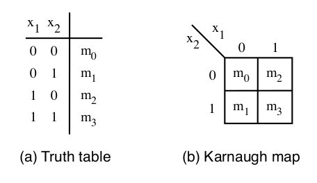
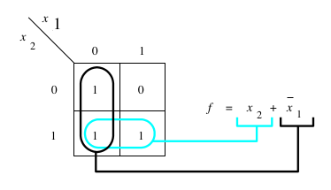
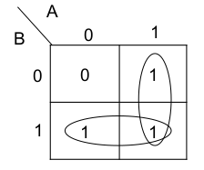
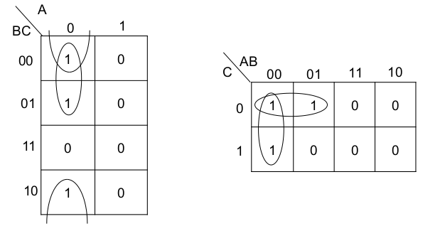
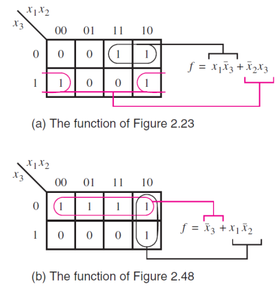
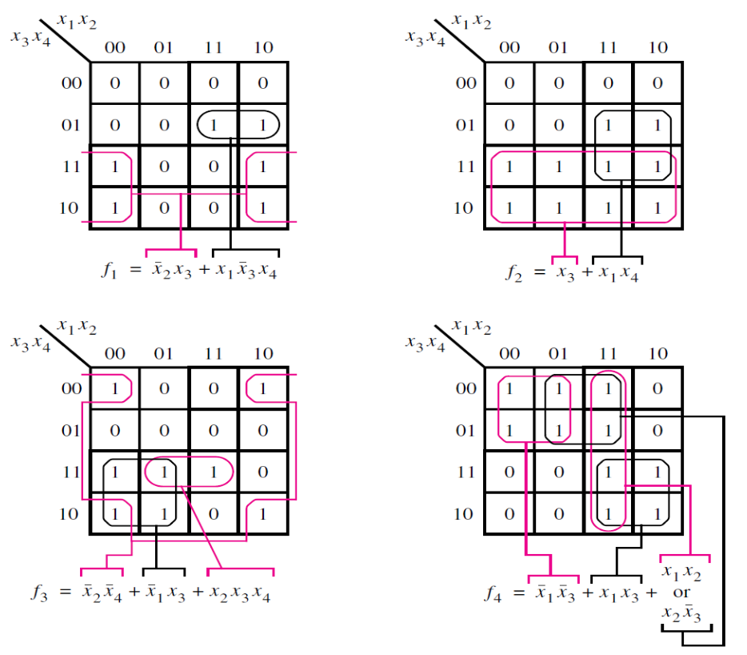
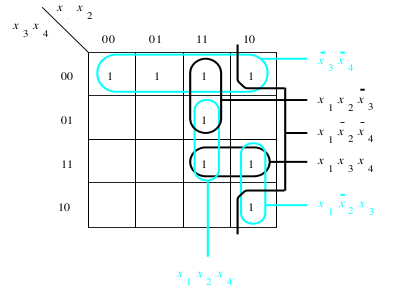
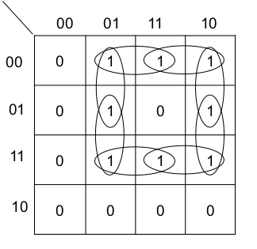

[\<- Boolean Algebra and DeMorgan's Theorem](3.md)

---

# Karnaugh Maps, Prime Implicants

## K-map structure, implicants, prime implicants

### Karnaugh Maps (K-Maps for short)

- Expresses same info as truth table but in different form

### Implicants

- Any product term that evaluates to true
- Two implicants that differ by just one variable (true and false) can be combined
	- `X*Y + X*!Y` = `X`
	- `X*Y*Z + X*Y*!Z` = `X*Y`]
	- A "larger" implicant even though less variables
- An implicant that can't be combined with another is called a "prime" implicant (PI)
	- Identifying the PI's allows us to synthesize simpler logic than canonical SOP

---

## Basics of using a K-map, with a 2-input function

### Minimizing with K Maps

- Circling adjacent cells represents combining two implicants into one
- A circle that "covers both values of a variable means it's not needed in the term
- It's OK for implicants to overlap

### K-map for the OR function

- We could define OR as F(A,B) = ∑m(1,2,3)
- If we synthesized using minterms we would get F = !A\*B + A\*!B + A\*B
	- But we know OR is F=A+B
- Using a K-map identifies overlap

---

## Structure of a 3-input K-map

### 3-input functions

- One side must represent two variables
	- Four values
- We want to keep the ability to circle adjacent cells to represent a larger implicant
	- Enumerate as 00, 01, 11, 10
- Opportunity to "cover" four cells
- Edge cells on opposite sides are still "adjacent"
	- 00 and 10 differ by one value

### Example 3-input K-map

- Can be drawn veritcally or horizontally (the example below shows both options)
- Also, order of variables doesn't matter
	- As long as you correctly apply the concepts

---

## Discerning product terms

- Every implicant, prime or not, can be specified as a product term
	- Individual cells are minterms
- A grouping of two means one of the variables is not needed because both the true and complement case are "covered"
	- For the remaining two variables, llok to see if they are 0 or 1 for the two cells
	- If 0, then the variable needs to be inverted before including in the product term
- A grouping of four reduces to one variable

---

## A few more 3-input K-map examples

- First map is "missing" a prime implicant

---

## 4-variable K-maps

### Going to four variables

- The vertical axis now covers two variables
	- Same ordering considerations: 00 01 11 10
- Now we can have prime implicants that cover 8 cells
	- Can't do 6
	- Every time you're combining you're accounting for the true and false version of one of the variables
		- Necessarily a power of 2
- Wrap-arounds in both directions

### 4-Input Examples

- Another missing prime implicant, in the upper left map
	- Can you find it?

- The missing prime implicant is the grouping of the 01-10 with the 11-10

---

## Essential prime implicants

- Once **ALL** prime implicants (PI's) are identified, there is typically some amount of overlap
- Including all PI's in the solution equation might be unnecessary
	- We'd like to find the simplest solution
- Some of the PI's will \*have\* to be in the solution equation -> they are essential
	- Visually, they are the PI's that contain cells (minterms) not covered by any other PI

### Visualizing essential PI's

- K-map below has all PI's circled 
- Only `!X3*!X4` is essential
- Minimal solution only needs to add greens
	- Complete coverage with just 2 more terms

### K-map with no essentials

- To fully illustrate the point, note this K-map has no essentials
	- Solution equation will have four terms

---

## Summary of the K-map process

### Synthesizing with K-maps

- Identify \*all\* PI's
	- Start with largest, to avoid non-primes
	- Don't forget to look for wrap-arounds
- Identify which PI's are "essential"
	- An essential PI contains cells that are not part of any other PI
- Write the SOP equation, starting with the essential PI's
	- Add the minimum number of non-essential PI's needed to "cover" all cases where the function should evaluate to true
