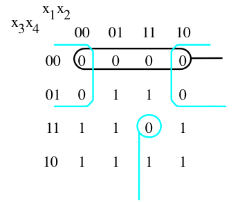
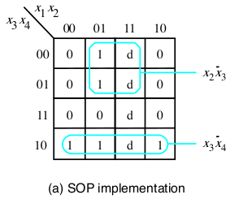
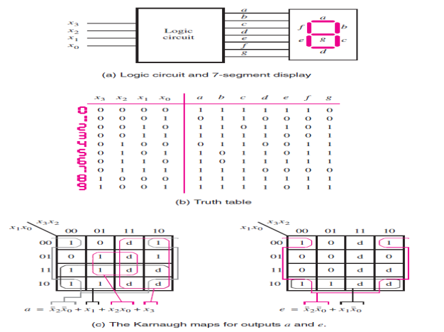

[\<- Karnaugh Maps, Prime Implicants](4.md)

---

# Additional K-map concepts: solving for 0's and use of don't cares

## Using the 0's in a K-map

### Consider the 0's

- Sometimes targeting the 0's yields a lower cost solution
	- Cost = #gates + #inputs to all gates
- Apply the same process of identifying PI's, but use the 0's instead of the 1's
	- Same as if we created K-map for the inverse of the functnio; call if g (=!f)

### POS example

- !f = `!x3*!x4 + !x2*!x3 + x1*x2*x3*x4`
- f = `!(!x3*!x4 + !x2*!x3 + x1*x2*x3*x4)`
- f = `(x3+x4) * (x2+x3) * (!x1+!x2+!x3+!x4)`

---

## The concept and use of don't cares

### Don't Cares

- Sometimes you know certain input combinations can't happen
	- You "don't care" how the logic handles it (wildcard)
- Include in an implicant to give it more coverage => "smaller" product terms

---

## Example of 7-segment display

- If you draw an "8" with equal-sized straight lines, there will be 7 such line "segments"
- All decimal digits (0-9) can be represented using a subset of these 7 segments
- A 7-segment display has 7 inputs, one for each segment
	- An assertion (1) causes that segment to light
- How to convert a 4-bit value, representing a number from 0-9, into the correct 7 controls?

---

## Summary of how to make use of don't cares

### K-maps with don't cares

- Our general process is to try to find the largest PIs possible
- Use don't cares to create larger PIs
	- Creates a product term with fewer variables
	- Applies whether solving for 1's or 0's
- A don't care cell does \*not\* make a PI essential

---

[Multiplexers ->](6.md)
