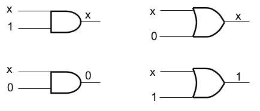
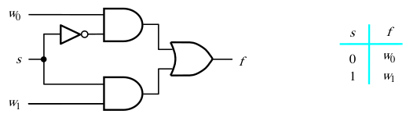
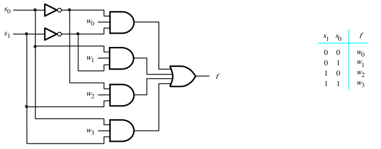
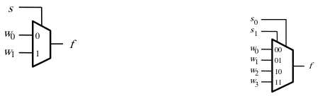
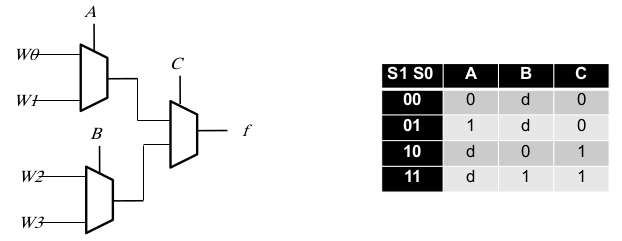
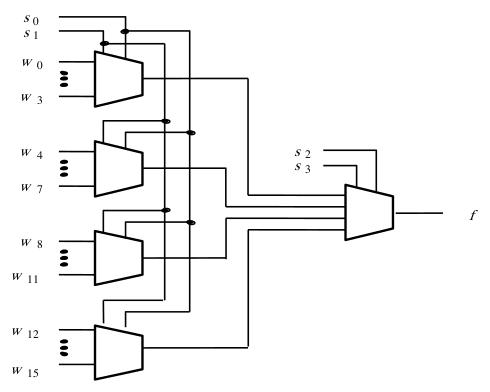

[\<- Additional K-map concepts: solving for 0's and use of don't cares](5.md)

---

# Multiplexers

## Enable and Disable

- Enable: allow the other input to pass thru
	- `X*1` = `X`
	- `X+0` = `X`
- Disable: make the other input irrelevant
	- `X*0` = `0`
	- `X+1` = `1`

---

## 2-to-1 mux

- "mux" is short for multiplexer

### Multiplexer

- Use a select signal to "pass" thru one of the two inputs
	- Only one of the two paths is "enabled"
- It doesn't matter what w0 and w1 are in the example below

---

## 4-to-1 mux

- If we have four choices we need 2 selects
	- N select signals allows 2^N choices
- Each AND gate has a unique "enable", and exactly one is enabled at any time

---

## Abstraction/schematic symbol for muxes

### Multiplexers as an abstraction

- So common (and useful) that there is a symbol for it
	- We don't have to keep drawing out the gates
- Values to pass thru are "data" inputs, or ports
- Be careful if/when ports aren't labeled
- Can be extended to any number of choices

---

## Hierarchy of muxes

### A 4:1 mux using 2:1 muxes

- A 2:1 mux can only take 2 inputs
	- Need two 2:1 muxes at least
	- Only narrows the choices from 4 to 2
	- So, one more mux to make final choice
- What are A,B,C in terms of S1,S0 in the diagram below?

### Extending the concept

- A 16-to-1 made up of 4-to-1 muxes:

---

[Shannon's expansion and FPGAs ->](7.md)
