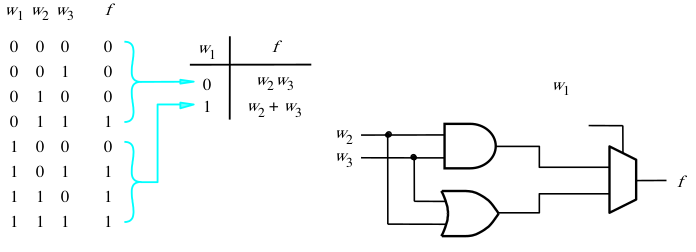
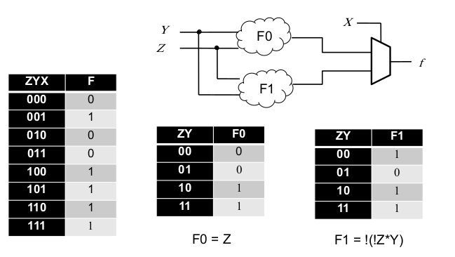
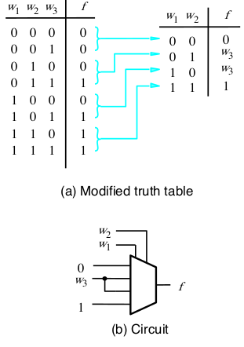
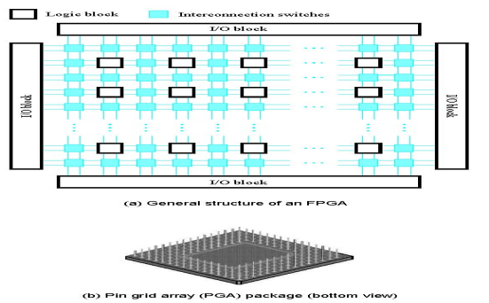
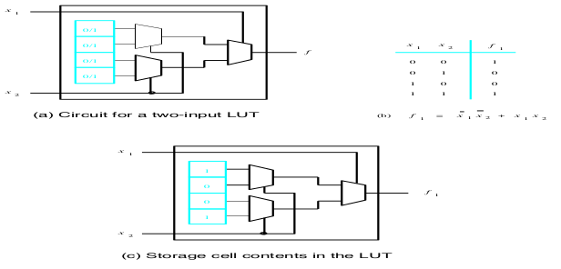
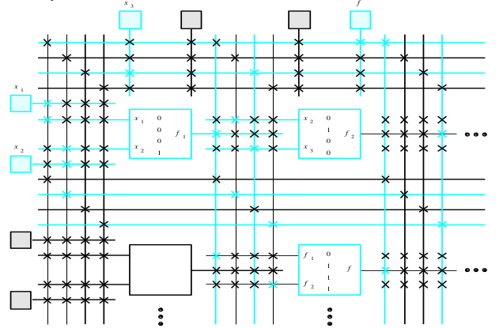

[\<- Multiplexors](6.md)

---

# Shannon's expansion, FPGAs

## Shannon's expansion with a 2:1 mux

### Synthesizing with a mux

- Say we had a function
	- `F = !X1*X2*X3 + X1*X2 + X1*X3`
- We could re-write as
	- `F = !X1*(X2*X3) + X1*(X2+X3)`
- Note the use of X1 here and think of the concept of enabling
	- If `X1=0`, the `X2*X3` term is enabled
	- If `X1=1`, the `X2+X3` term is enabled
- The true and complement form of X1 is choosing which term to enable => mux

### Shannon's Expansion

- Any truth table can be broken into two sub-tables, with the sub-functions used as inputs to a mux
	- Any input can be used as the select
	- Write out the sub-tables if you need to

### Another example

- Say we chose to use X as the select in the example below
	- Z is easier to see; F0 and F1 would be f(Y,X)

---

## Synthesizing with a 4:1 mux

- Now we use 2 inputs as the select
- For a 2-input truth table, each of the data ports will be either a 1 or 0
	- Inputs are "tied" high or low
- What if we have 3 inputs?
	- Data ports are a function of the remaining input
	- Four possibilities:
		- True or inverted version of input 3, or tie high or low

### Example

---

## Analysis/synthesis revisited

- Whether a circuit is described by an equation or a schematic, it can be analyzed to generate the truth table
- The behavior specified by the truth table can then be synthesized into a completely different circuit structure
	- Including a set of muxes
	- If a circuit is a black box, and you just see the inputs and outputs, you may not know (or care) how it's synthesized

---

## FPGAs

- An array of programmable interconnects and logic blocks
- Note that we will not really be tested on this, it is mainly to demonstrate an example of the above topic

### Lookup Table

- Logic blocks are muxes with programmed inputs
- Inputs to the logic block are used as mux selects

### Example

- Implements `f = X1*X2 + !X2*X3`
	- Green crosses touch, black crosses do not

