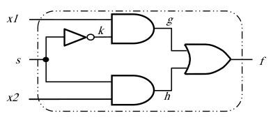
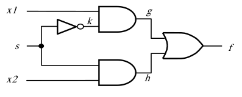
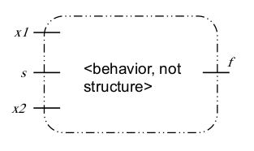
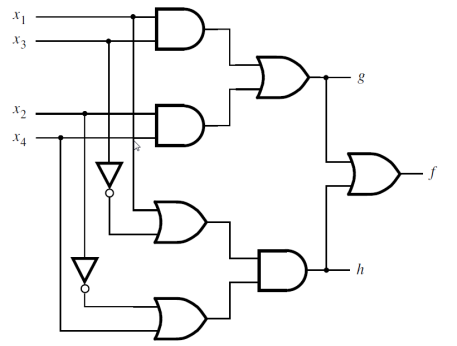
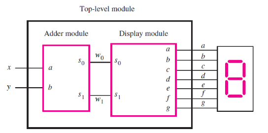
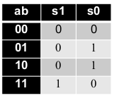

[\<- Shannon's Expansion and FPGAs](7.md)

---

# Verilog basics

## Introductory Verilog concepts

### Verilog

- A language to specify hardware
	- Hardware Description Language (HDL)
- Has many features of other programming languages but it does \*not\* execute sequentially like most languages do
- Can specify structure or behavior
	- Structure is like an actual circuit; netlist
	- Behavior would be like logic equations or truth table
		- Can be synthesized into a specific structure

### Verilog module

- HW is always described inside a module
	- Like a schematic
- Always at least one output, and then however many inputs the circuit consumes
	- Referred to as ports
	- Taken together this is called the interface
- Variable names are used to make connections, either from ports to internal circuitry or between circuit elements inside the module

---

## Describing structure of 2:1 mux

- Example: Inputs x1,x2, and s, and output f
	- This is the interface
- Need to describe what's happening inside
	- Need to describe how gates are connected
		- Use Verilog primitives to describe structure



### Interfaces for primitves

- AND (2-input example):

```	
module and(y,x1,x2);
	input x1,x2;
	output y;
```

- OR (4-input example):

```
module or (y,x1,x2,x3,x4);
	input x1,x2,x3,x4;
	output y; 
```

- NOT (always just one input):

```
module not (y,x);
	input x;
	output y; 
```

### Structural example

- A gate-level implementation of a 2:1 mux
- Ports connected by name association
	- E.g., "k" connects the output of the NOT gate to one of the inputs to the first AND gate

```
module example1(x1, x2, s, f);
	input x1, x2, s;
	output f;
	wire k, g, h;

	not(k, s);
	and(g, k, x1);
	and(h, s, x2);
	or(f, g, h);

endmodule
```



- Note that the declaration of the wires in the above code is optional, but makes for good habit
	- If not explicitly declared, `k`, `g`, and `h` would be implicitly considered wires by Verilog 

---

## Behavioral description of 2:1 mux

### Behavioral code

- Uses syntax like our boolean algebra equations
	- `&` instead of `*` 
	- `|` instead of `+`
	- `~` instead of `!`
- Keyword of `assign` means the equation is always evaluated, just like logic gates work

```
module example3(x1, x2, s, f);
	input x1, x2, s;
	output f;

	assign f = (~s & x1) | (s & x2);

endmodule
```



---

## Behavioral description of a more complex module

- Describe this circuit, with outputs f, g, h



- Assign statements don't have to be in the order listed
	- Specifying the behavior of a wire
- Also don't have to specify intermediate nodes

```
module example4(x1, x2, x3, x4, f, g, h);
	input x1, x2, x3, x4;
	output f, g, h;

	assign g = (x1 & x3) | (x2 & x4);
	assign h = (x1 | ~x3) & (~x2 | x4);
	assign f = g | h;

endmodule
```

---

## Hierarchy in Verilog

### Hierarchical design

- Block diagram of two modules working together
	- Outputs of adder module connected to inputs of display module



### Code for the adder

- What is the truth table for a circuit that treats two inputs as numbers and adds them together?



```
//An adder module
module adder(a, b, s1, s0);
	input a, b;
	output s1, s0;

	assign s1 = a & b;
	assign s0 = a ^ b;

endmodule
```

- Note that `^` is XOR in Verilog

### Code for the display driver

- Useful to work out the truth table in order to figure out the equations

```
//A module for driving a 7-segment display
module display(s1, s0, a, b, c, d, e, f, g);
	input s1, s0;
	output a, b, c, d, e, f, g;

	assign a = ~s0;
	assign b = 1;
	assign c = ~s1;
	assign d = ~s0;
	assign e = ~s0;
	assign f = ~s1 & ~s0
	assign g = s1 & ~s0

endmodule
```

### Instantiating and connecting

- Note the "wire" declarations for the internal (to this module) connections between adder and display
	- Variables not part of interface definition

```
module adder_display (x, y, a, b, c, d, e, f, g);
	input x, y;
	output a, b, c, d, e, f, g;
	wire w1, w0;

	adder U1(x, y, w1, w0);
	display U2(w1, w0, a, b, c, d, e, f, g);

endmodule
```

---

[Number systems and adders ->](9.md)
