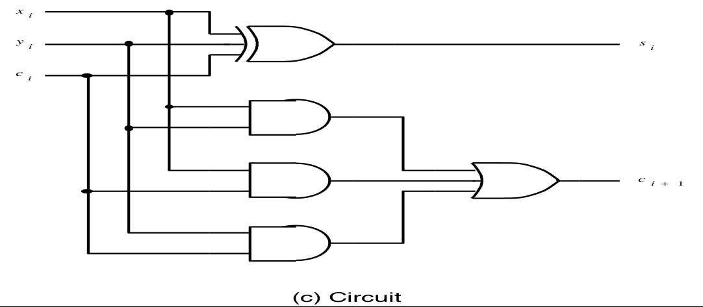

[\<- Verilog basics](8.md)

---

# Number systems and adders

## Hexadecimal numbers

### Binary and hexadecimal

- Binary is base-2, digits range from 0->1
- Decimal is base-10, digit range: 0->9
- Hexadecimal (hex) is base-16, 0->15
	- Need digits for 11-15
	- Use, A, B, C, D, E, F
- Hex range in binary is exactly 4 bits
	- Used as a convenience for expressing 4 bit groupings for values that are a large number of bits

### Comparison

- Convention is to preced hex with 0x
	- e.g., 0x10 means 16, not 10

|Decimal|Binary|Octal|Hexadecimal|
|-------|------|-----|-----------|
|00     |00000 |00   |00         |
|01     |00001 |01   |01         |
|02     |00010 |02   |02         |
|03     |00011 |03   |03         |
|04     |00100 |04   |04         |
|05     |00101 |05   |05         |
|06     |00110 |06   |06         |
|07     |00111 |07   |07         |
|08     |01000 |10   |08         |
|09     |01001 |11   |09         |
|10     |01010 |12   |0A         |
|11     |01011 |13   |0B         |
|12     |01100 |14   |0C         |
|13     |01101 |15   |0D         |
|14     |01110 |16   |0E         |
|15     |01111 |17   |0F         |
|16     |10000 |20   |10         |
|17     |10001 |21   |11         |
|18     |10010 |22   |12         |

---

## Converting binary to hex and vice versa

- No need to understand base-16 arithmetic
	- Easy conversion from one form to another
- Example binary to hex
	- 0011011010001110 would compress to
		- 0011 -> 3
		- 0110 -> 6
		- 1000 -> 8
		- 1110 -> E
		- 368E or 0x368E
- Going the other way, hex to binary
	- 0x407B would expand out to 0100000001111011

---

## Adding binary numbers, and the Full Adder (FA) circuit

### The Process of Addition

- A 2N-input truth table? Ouch
- Let's decompose instead
	- Add numbers in the same position, including the "carry-in" -> 3 inputs
	- Result is a sum and carry-out -> 2 outputs


### The Full Adder (FA) Circuit




---

## The ripple carry adder

- Use full adders and connect the carry-out to the carry-in of the next position
	- The carry ripples thru the addrs
	- Set c0 to 0 (unless we want to add 1...)
- This is one approach; many ways to add


---

## 4-bit adder, abstraction and hierarchical Verilog description

### A 4-bit adder

- 4-bit inputs => 4-bit output
	- A hardware contruct, with wires and gates


### A 4-bit adder in verilog

```
module adder4(carryin, x3, x2, x1, x0, y3, y2, y1, y0, s3, s2, s1, s0, carryout);
	input carryin, x3, x2, x1, x0, y3, y2, y1, y0;
	output s3, s2, s1, s0, carryout;

	fulladd stage0(carryin, x0, y0, s0, c1);
	fulladd stage1(c1, x1, y1, s1, c2);
	fulladd stage2(c2, x2, y2. s2, c3);
	fulladd stage3(c3, x3, y3, s3, carryout);

endmodule

module fulladd(Cin, x, y, s, Cout);
	input Cin, x, y;
	output s, Cout;

	assign s = x ^ y ^ Cin;
	assign Cout = (x & y) | (x & Cin) | (y & Cin);

endmodule
```
